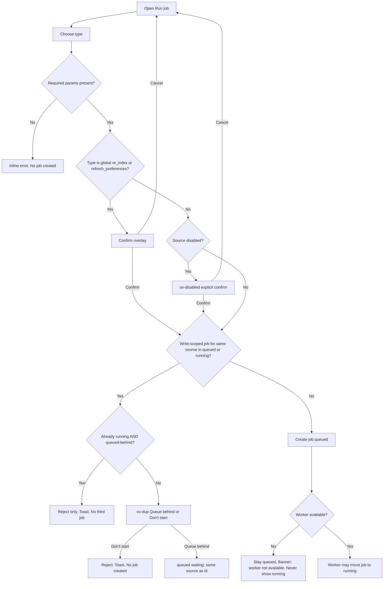
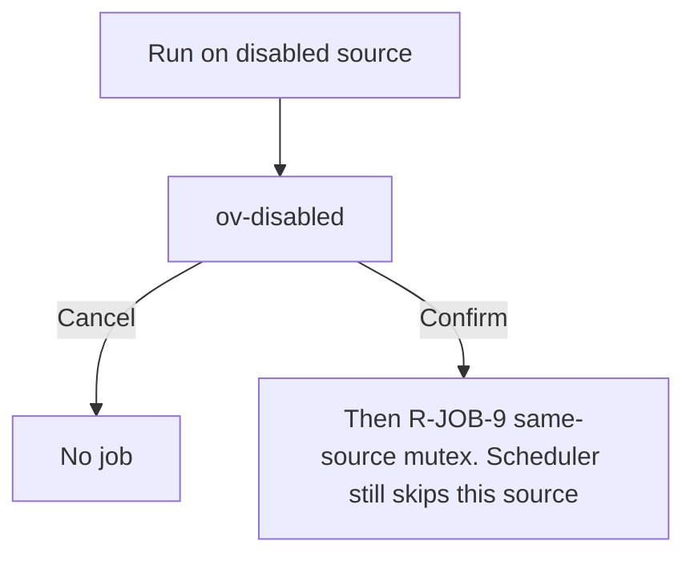
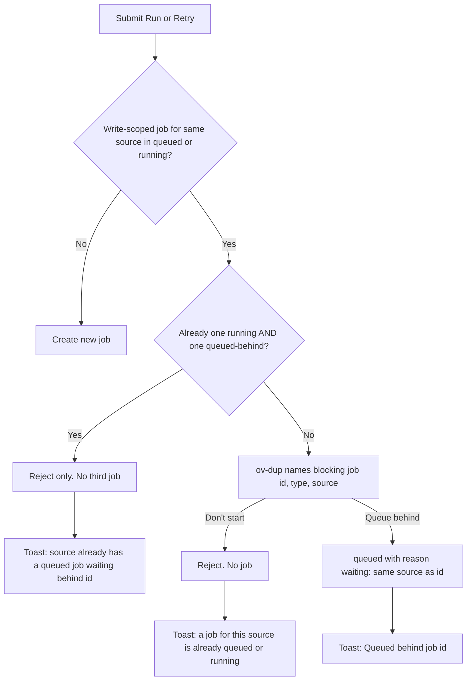
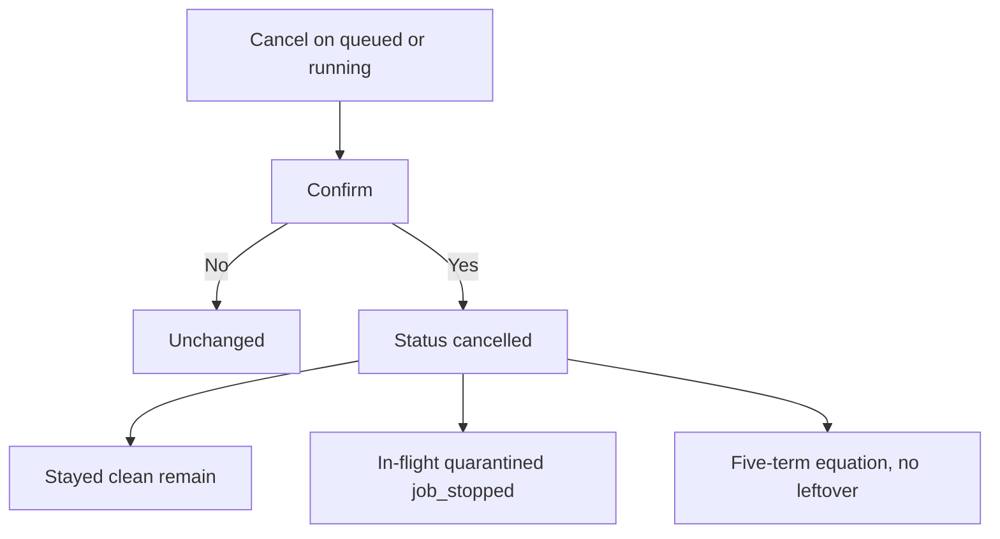
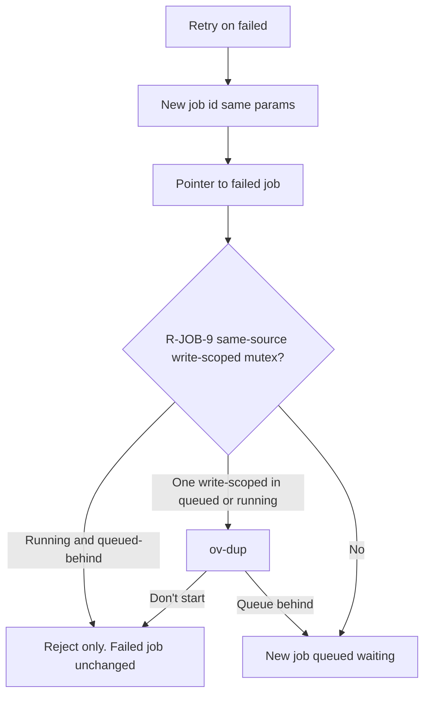
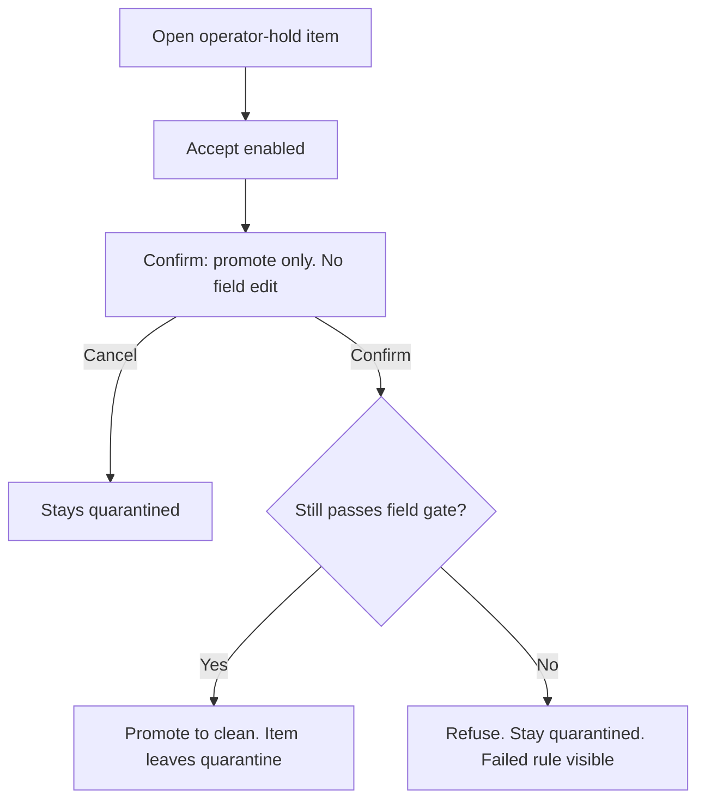
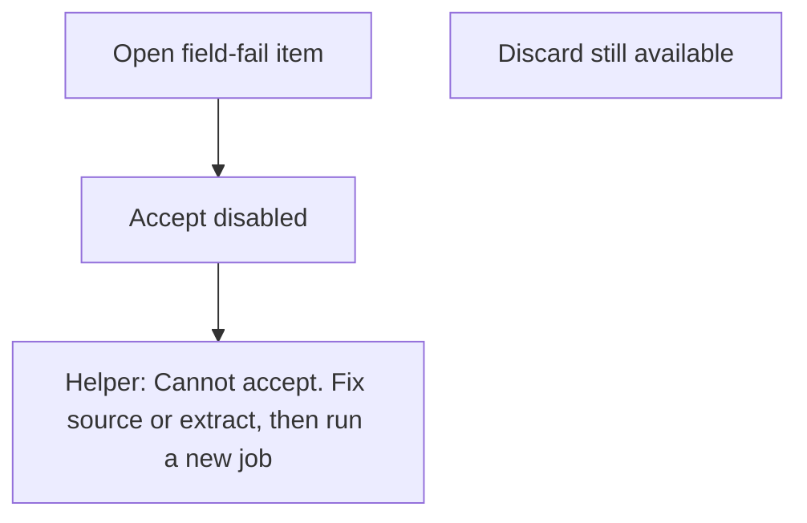
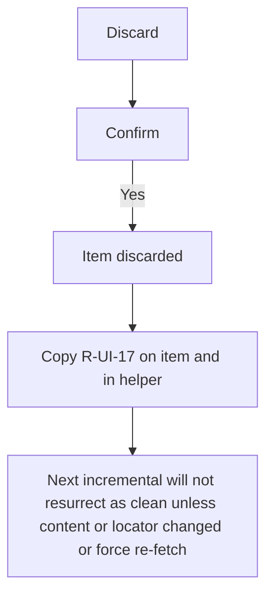
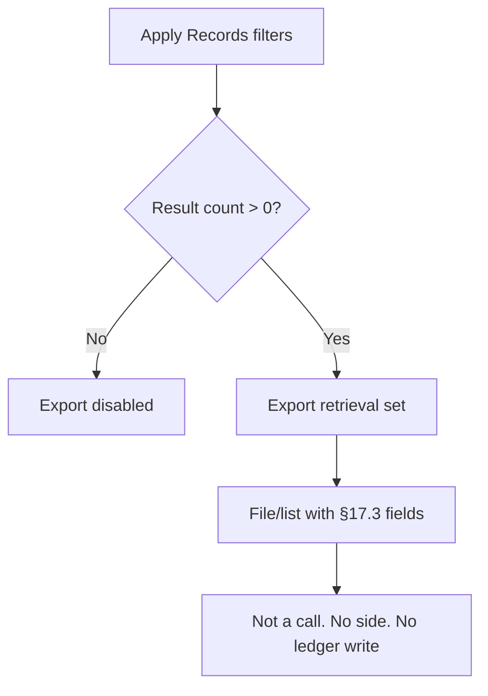
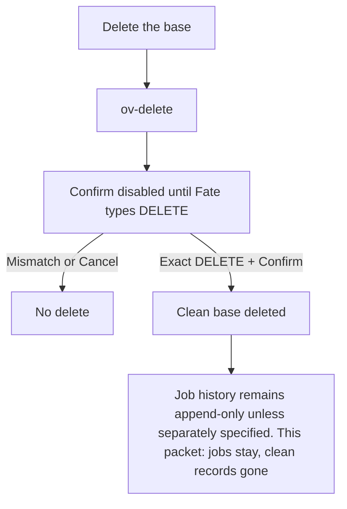

# PTRP Spec

**Artifact:** Spec  
**State:** Approved  
**Version:** v7  
**Date:** 2026-08-30  
**Owner:** Specification Writer  
**Verdict:** `/workspace/ptrp-spec-draft-review-v7.md` (APPROVED). Frozen snapshot `/workspace/ptrp-spec-approved-v7.md`. Frozen v5 at `/workspace/ptrp-spec-approved-v5.md` is history. Engineer and QA consume this file. S1–S12, CR-E1, CR-E2, and CR-QA-1 through CR-QA-11 are closed. Do not open v8.  
**UI/UX:** pulled from UI/UX Ninja into §8 and `/workspace/ptrp-ui-mockups/index.html` (README `/workspace/ptrp-ui-mockups/README.md`).  
**Consumable Spec:** this file. Historical pipeline and v0-spec files are not imported.  
**Advisory A1:** a leftover §6 “Each record returned” list without `named_party` is struck. S12 wins. The list below includes `named_party`. Do not implement the stale omit.  
**Advisory A2:** packet leftover “Global jobs are not this mutex” remains struck by §5.5 / A5b. Do not reopen S2.

This Spec does not name a language, framework, database, host, or vendor.

---

## 0. Accepted Goal

**Product.** PTRP, a standalone pipeline app Fate operates to ingest public Trump records into one knowledge base and run jobs from dashboard, control, records, and quarantine.

**Done-when.** That app is built and in production, and a stranger can start and inspect jobs, browse clean records, and handle quarantine on those four screens, with no call-loop, no side picker, and no in-place clean-text edit.

**Production (this Spec).** One Fate-operated running instance, reachable without this chat, that persists the knowledge base across restarts and exposes the four screens plus the §6 read actions. How it is hosted is not specified.

---

## 1. In scope

- Standalone single-operator app. Fate is the only operator.
- Four chrome screens only: Dashboard, Control, Records, Quarantine.
- Jobs as the only ingest path: `incremental`, `backfill`, `targeted`, `re_extract`, `re_index`, `refresh_preferences`.
- Sources: `whitehouse_remarks`, `whitehouse_actions`, `app`, `factbase`, `federal_register`, `truth_social`, `x_personal`, `campaign`, `books`, `interviews`, `legal`.
- One knowledge base: raw artifacts (immutable), clean records, derived preferences.
- Clean vs quarantine hard split. Quarantine reasons: field-fail and operator-hold.
- Operator-edited topic list, occasion list, interview-outlet allowlist (default empty), official X pin, official Truth Social pin.
- Dashboard health for (topic × counted channel): `ready` or `not-ready` only. Thin is a not-ready reason, not a third rank. No venue object. No venue picker.
- Source freshness badges: cadence stale and 24h stale. Both shown. App does not store a live-bet-window object. Automated `not-ready` from staleness uses cadence stale only.
- Read actions on the Records screen: `Search`, `GetRecord`, `GetPreference`, `ExportRetrievalSet`.
- Books and campaign are required sources. Books use `channel = other` and are not mention-usable.
- Display timezone America/New_York. Stored times UTC. Operator screens never show a UTC timestamp.
- Operator worker Stop and Start (CR-QA-1). Operator Restart the app (CR-QA-2). Operator Records-reads down (CR-QA-3). Operator Fail next load (CR-QA-4). Per-source Connector `ok` / `network` / `auth` / `parse` (CR-QA-5). Targeted Operator item (CR-QA-6, CR-QA-7, CR-QA-8). Probe clock (CR-QA-10). Topic rows appear when a topic is added, before ingest (CR-QA-11).
- Clean legal field `named_party`. Clean legal requires `named_party` equal to `Donald Trump`. Operator surfaces for that field: `ov-record` (kind `legal`), GetRecord, and Export (S12).
- Targeted mode Query vs Operator item (S10). Probe-clock weekday 09:00 tick (S11).

## 2. Out of scope

- Call loop, side picker, confidence field, confidence UI, ledger, grading, place-a-call, resolution UI, `no_call` behavior.
- In-place edit of clean text or clean fields.
- Second or hidden knowledge base.
- Multi-user, roles, public website, account switcher.
- Private, leaked, or non-public ingest.
- Speech, voice, or synthetic Trump text.
- `written_other` as a channel. Channels are only `spoken`, `written_social`, `written_official`, `legal`, `other`.
- Venue, venue picker, venue-scoped thin, venue-scoped ready.
- Mock-only worker switch that does not apply S5. Typed DELETE of the base as a restart. A UTC column on an operator screen.
- Upcoming-calendar source or retrieve.
- `remark_count` / `decision_value` product surfaces.
- “The administration” as a legal named party.
- Language, framework, host, database, vendor.

## 3. Non-goals

- Predicting markets or recommending a side.
- Placing or sizing bets.
- Filling idle time with extra screens.
- A cron builder in v0 UI (cadence display is read-only).
- A people-vocabulary editor in v0 UI.

---

## 4. Actors

| Actor | Role |
| --- | --- |
| Fate | Sole operator. Starts, watches, stops, inspects jobs. Reads the base. Accepts or discards quarantine. Edits vocabularies and pins. |
| Scheduler | Enqueues `incremental` jobs from enabled source schedules. Not a second user. |

Readers outside this app are not actors in this Spec. They are not specified here.

---

## 5. Required behavior (no hidden implementation)

Rules below are product behavior. They do not imply modules, tables, or a stack. They are complete in this file.

### 5.1 App

- The app is standalone, with its own UI, separate from this chat.
- Displayed times are America/New_York.

**Worker down (S5).** When the worker that executes jobs is not available:

1. Banner on every screen.
2. Every job whose **stored** status is `running` is stored as `failed` with readable error `worker_lost`. Display matches stored status. No row is `running`.
3. Commit rule S6 applies (same as any `failed` or `cancelled` job).
4. A `failed` job does not occupy the write mutex. A `queued` job still does.
5. A returning worker does not resume the `worker_lost` job. It executes the next `queued` job, if any. Fate retries the failed job as a new job id (same params, pointer to the failed job).
6. New Run creates `queued`. Nothing is shown or stored as `running` while the worker is down.

**Commit on stop (S6).** One rule for `failed`, `cancelled`, and `worker_lost`. No other branch.

1. Clean records already written under that job id **stay**. They keep that job id. The job reports how many stayed.
2. In-flight items (fetched or extracted, not yet written as clean) are **not clean**. They are always quarantined as field-fail with reason `job_stopped`. They count as `quarantined` in that job’s sum. There is no never-committed bucket. Accept is disabled on these items. A later job for the same locator may write them clean if they then pass the gate.
3. After the job is terminal, the index contains exactly the stayed clean set. Quarantined in-flight items are not in the index. Stayed clean records are not stripped from the index.
4. After the job leaves `running`, that job id writes no further clean records, index rows, or preference rows. It does not delete stayed clean records.
5. Clean records from earlier `succeeded` jobs stay.

While a job is `running`, the index may include clean records already written under that job id. That is the same stayed set if the job later stops. Index-before-succeeded does not authorize clean rows that S6 would drop.

**In-flight bucket (S9).** On a finished fetch job, counts add up with no leftover:

`fetched = written + updated + unchanged + quarantined + fetch_fail`

In-flight with no other gate fail still enter `quarantined` (`job_stopped`). They are not a sixth term. `written` and `updated` are the S6 stayed set only.

**Targeted Query vs Operator item (S10).** The Query-only targeted require (a topic, query, or occasion; refuse copy `Targeted needs a topic, query, or occasion.`) applies only to targeted mode **Query**. It does not apply to targeted mode **Operator item**. Operator item required fields are source, locator, text, kind, and channel. Missing any of those is refused in place with copy `Operator item needs source, locator, text, kind, and channel.` That refuse is not F2. A `written_social` Operator item, or an Operator item whose source is `truth_social` or `x_personal`, is refused in place if no pin is set, with copy `A written_social Operator item is refused if no pin is set.` That refuse is not F2. F2 and A4 remain Query.

**Probe-clock 09:00 tick (S11).** Setting the probe clock to a weekday 09:00 America/New_York instant is the tick: enqueue `incremental` once for each enabled non-exempt source due that day, then advance next-run. Remaining on that frozen instant after the advance does not enqueue again. Setting to a weekday before 09:00 does not enqueue. Saturday and Sunday never enqueue (F47). Display of next-run is not that tick.

**named_party operator surface (S12).** `named_party` is a closed clean field. Clean `legal` requires it equal to `Donald Trump`. `ov-record` shows `named_party` when kind is `legal` (read-only). GetRecord includes `named_party`. Export retrieval set includes `named_party`. Absence of `named_party` on a would-be `legal` item is field-fail, not a silent drop.

### 5.2 Knowledge base

- Successful fetch stores an immutable raw artifact (bytes or text as retrieved) with source identity, locator, retrieval time, and job id. Re-fetch creates a new artifact.
- A clean record exists only when attribution, the timestamps that channel needs, and text pass the clean gate. Otherwise the item is quarantined.
- **Clean record fields (closed).** `record_id`, `kind`, `title`, `event_time`, `published_time`, `text`, `text_version`, `text_hash`, `completeness`, `url`, `source`, `occasion`, `audience`, `delivery`, `channel`, `topics`, `people`, `phrases`, `term`, `mention_usable`, `decision_usable`, `named_party`. There is no `confidence` field. `named_party` is required on clean `legal` records and is `Donald Trump` on those records. Absence of the field on a would-be `legal` item is field-fail, not a silent drop (S12).
- **Channel enum (closed):** `spoken` | `written_social` | `written_official` | `legal` | `other`. Books are `other`.
- Clean `record_id` is stable. Text changes write a new `text_version` and `text_hash`. Prior versions stay resolvable.
- Spoken and decision records require `event_time`. `written_social` requires `published_time`. Missing the required timestamp → quarantine, or if already clean, clear `mention_usable` / `decision_usable` until the time is present.
- Kinds the base can hold: `remark`, `decision`, `writing`, `interview`, `social`, `legal`, `staffing`.
- Decision records also store `act_type`, `direction`, `status`, and links to related remarks.
- Preferences are derived. They cite supporting and contradicting clean record ids. Minimum: two independent clean records, or one official-act record plus one remark. Independent means different events: different `event_time` + occasion, or one decision plus one remark. Two locators of one utterance are one preference record.
- Reversals are representable (`consistency = reversed`) and are not averaged into a middle stance.
- First-term and current-term evidence stay distinguishable.

### 5.3 Ingest / normalize / extract / index

- Fetch is public items from configured sources inside the job’s scope.
- Sources not on the configured list are refused. Adding a source is operator configuration, not a job side effect.
- No anonymous gossip, unsourced leaks, spoofed social accounts, or AI-generated audio/video presented as Trump.
- Fetch that returns nothing in-scope is `succeeded_empty` (fetched = 0). It does not move freshness.
- Original text is kept. A summary does not replace source text on the clean record.
- Completeness is `full_transcript` | `excerpt` | `paraphrase`. Mention-usable reads `completeness`, not `delivery`. Paraphrase is not a verbatim mention source.
- Same locator, or near-duplicate text from the same source and time, collapses to one `record_id`.
- Extract writes topics and occasions only from operator lists. A tag not on the list is quarantined, not a new vocabulary entry. “Like the last time this occasion happened” means the same occasion tag. No fuzzy similarity.
- Phrase inventory is exact strings from the text (plus plural / possessive). Synonyms are not invented.
- Preference extract that cannot cite records does not write a preference.
- Index is searchable by full text, exact phrase, `event_time` window, `published_time` window, channel, occasion, term, topic, source, kind, mention-usable, decision-usable.
- While a job is `running`, the index includes clean records already written under that job id. On `succeeded` / `succeeded_empty`, the index matches that job’s finished clean set. On `failed` / `cancelled` / `worker_lost`, S6 applies: index equals the stayed clean set.

### 5.4 Sources

| ID | What must come in |
| --- | --- |
| `whitehouse_remarks` | Official spoken remarks, addresses, exchanges with reporters |
| `whitehouse_actions` | Official presidential actions as published |
| `app` | American Presidency Project documents for both terms |
| `factbase` | Transcript archive used when official or APP text is missing or incomplete |
| `federal_register` | Executive orders, proclamations, memoranda |
| `truth_social` | Posts from his personal Truth Social account |
| `x_personal` | Posts from his personal X account |
| `campaign` | Campaign remarks and platform text, tagged as campaign, not governing |
| `books` | Long-form writing he authored or signed, dated and attributed |
| `interviews` | Interview and gaggle transcripts from named outlets |
| `legal` | Filings where the named party is Donald Trump, or a presidential action already in `whitehouse_actions` / Federal Register |

- Fate enables or disables each source from Control. A disabled source is not enqueued by the scheduler. Fate may still run it manually, with confirm.

**Factory `enabled` (CR-E1).** On first boot of an empty instance, all eleven sources are `enabled`. There is no first-run wizard. `enabled` is independent of `blocked`: `interviews` still shows `blocked: empty allowlist`; `x_personal` and `truth_social` still show `blocked: empty pin` while those pins are empty. Fate’s later disable/enable is what persists across restarts. Factory is not reapplied on restart of a non-empty instance.

**Legal `(kind, channel)` per source (S7, closed).** A write whose pair is not in this set is field-fail, not clean. No other pairs.

| Source | Legal pairs |
| --- | --- |
| `whitehouse_remarks` | `(remark, spoken)` |
| `whitehouse_actions` | `(decision, written_official)`, `(staffing, written_official)` |
| `app` | `(remark, spoken)`, `(decision, written_official)`, `(writing, written_official)` |
| `factbase` | `(remark, spoken)` |
| `federal_register` | `(decision, written_official)` |
| `truth_social` | `(social, written_social)` |
| `x_personal` | `(social, written_social)` |
| `campaign` | `(remark, spoken)`, `(writing, other)` |
| `books` | `(writing, other)` |
| `interviews` | `(interview, spoken)` |
| `legal` | `(legal, legal)` |

- Dashboard per source: enabled, last successful job, time since that success, clean-record count, last error, blocked reason if any.
- `interviews` ingest only outlets on the allowlist. Default allowlist is empty. Source shows `blocked: empty allowlist`. An item from an outlet not on the list is not clean. Empty jobs do not make it fresh.
- `books` and `campaign` are required. Books are not mention-usable. Channel for books is `other`.
- `legal` named party is Donald Trump, or a presidential action already stored under `whitehouse_actions` / Federal Register.

**Empty official pins (S4).** Official X pin and official Truth Social pin are operator config.

- Empty X pin → `x_personal` shows `blocked: empty pin`. No clean `written_social` from that source. Fetched items are field-fail (pin required). Freshness does not move.
- Empty Truth Social pin → same for `truth_social`.
- Empty pin is match-none, not match-all. A lookalike against a set pin is quarantined, not clean.

### 5.5 Jobs

| Type | Requirement |
| --- | --- |
| `incremental` | Fetch items new since that source’s last `succeeded` job with fetched > 0 |
| `backfill` | Fetch items inside an operator-supplied date window, including history |
| `targeted` | Fetch items matching an operator-supplied topic, query, or occasion (mode Query), or process one operator-supplied item (mode Operator item, S10) |
| `re_extract` | Re-run extract on stored records (no new source required unless text is missing) |
| `re_index` | Rebuild the index from stored clean records |
| `refresh_preferences` | Rebuild derived preferences from current clean records |

- Fate shall not have to run a source outside the app to achieve any of these types.
- `incremental`, `backfill`, and `targeted` are scoped to one source. `re_index` and `refresh_preferences` are global. `re_extract` may be one source or global.
- `backfill` requires a date window. Targeted **Query** requires a topic, query, or occasion. The UI refuses Query without them (copy `Targeted needs a topic, query, or occasion.`). That require does not apply to targeted **Operator item** (S10).

Every job stores: id, type, source (or `global`), params, status, triggered_by (`user` / `schedule` / `retry`), created/started/finished times, counts (fetched, written, updated, unchanged, quarantined), error, log reference, artifact reference.

- Times stored UTC, shown America/New_York. Operator screens never show a UTC timestamp. Chrome, tables, drawers, and overlays show only America/New_York with label `ET` (CR-QA-9).
- Counts on a finished job add up. Fate can see where items went.

Statuses: `queued` → `running` → `succeeded` | `succeeded_empty` | `failed` | `cancelled`.

- A job sits in `queued` until a worker is actually executing it.
- Fate can cancel `queued` or `running`. On `failed`, `cancelled`, and `worker_lost`, S6 is the only commit rule.
- Retry creates a new job id with the same params and a pointer to the failed job. History is kept.
- `succeeded` means: scoped work finished, at least one item fetched, index matches that job’s finished clean set, counts written, no unacknowledged crash. Empty-in-scope is `succeeded_empty`.
- `failed` means: the job stopped before `succeeded`, with a readable error. S6 applies.
- Re-running the same source and window shall not duplicate clean records for the same locator.
- Force re-fetch pulls new raw artifacts and may write a new `text_version` on the same `record_id`. It shall not invent a second current id, and it shall not destroy the prior version.
- Every clean write or update is attributable to exactly one job id.

**Write mutex (S2).** Two jobs shall not write the same source concurrently.

Write-scoped jobs: `incremental`, `backfill`, `targeted`, source-scoped `re_extract`. Incremental and backfill must not write the same source at once.

Global `re_extract` writes extracts on stored records of every source. It is write-scoped against **every** source. If any source has a write-scoped job `queued` or `running`, Fate chooses queue-behind (the global job waits until every touched source is free) or don’t-start. Starting a source write job while global `re_extract` is `queued` or `running` is the same choice for that source. If a touched source already has one `running` and one queued-behind, a further job is rejected only. Fate sees which.

`re_index` and `refresh_preferences` write derived layers for every source (index, preferences). They take the same global write lock as global `re_extract`. Confirm before start (already required).

### 5.6 Freshness and coverage

Counted channels: `spoken`, `written_social` only.

**Covering sources (S8, closed).** These are the only sources that participate in stale-for-not-ready for that counted channel.

| Counted channel | Covering sources |
| --- | --- |
| `spoken` | `whitehouse_remarks`, `app`, `factbase`, `campaign`, `interviews` |
| `written_social` | `truth_social`, `x_personal` |

`whitehouse_actions`, `federal_register`, `books`, and `legal` do not cover a counted channel. They do not participate in stale-for-not-ready.

**Cadence or exempt (S8, every source).**

| Source | Cadence | Stale-for-not-ready |
| --- | --- | --- |
| `truth_social` | daily | yes (`written_social`) |
| `x_personal` | daily | yes (`written_social`) |
| `whitehouse_remarks` | daily | yes (`spoken`) |
| `whitehouse_actions` | daily | no (does not cover) |
| `app` | weekly | yes (`spoken`) |
| `factbase` | weekly | yes (`spoken`) |
| `federal_register` | weekly | no (does not cover) |
| `campaign` | weekly | yes (`spoken`) |
| `interviews` | daily | yes (`spoken`) |
| `books` | none (exempt) | no |
| `legal` | none (exempt) | no |

- **Cadence stale:** daily sources more than one weekday since last `succeeded` with fetched > 0; weekly sources more than eight days. Exempt sources have no cadence clock and are never cadence-stale.
- **24h stale:** wall-clock age of that same success > 24 hours (sources with a cadence only). Shown as a badge. Not stored as a live bet window. Automated `not-ready` from staleness does not use this badge.
- `succeeded_empty` does not reset either clock.

**Default schedule clock (CR-E2).** Clock is 09:00 America/New_York. No other hour.

- Daily sources: next run is the next weekday 09:00 ET that is not in the past. If now is a weekday before 09:00 ET, that is today 09:00. If now is a weekday at or after 09:00 ET, that is the next weekday 09:00 (Friday after 09:00 → Monday 09:00). Saturday and Sunday never receive a scheduled run.
- Weekly sources: next run is the next Monday 09:00 ET that is not in the past. If now is Monday before 09:00 ET, that is this Monday 09:00. If now is Monday at or after 09:00 ET, that is the following Monday 09:00.
- Exempt `books` and `legal`: `not scheduled`. v0 UI has no cron builder. There is no operator-added schedule for them. Manual Run remains.
- Disabled source: `not scheduled`, even if it has a cadence.
- Display of `next scheduled run` is that datetime in America/New_York, or the exact copy `not scheduled`.
- The scheduler enqueues `incremental` at that datetime for enabled sources that have a cadence. It shall not enqueue a disabled source, an exempt source, or a source that already has a `queued` or `running` job. Manual Run never waits for the schedule. Fate can run any source on demand the same day. The schedule does not poll overnight or weekends.
- **Thin:** fewer than three mention-usable (remark) or decision-usable (decision) rows in the counted channel; or zero `2025_present` usable rows in that channel; or zero usable rows in a counted channel. Raw clean count is not this bar. UI shows which clause failed. No venue.
- **Not-ready:** thin, or every covering source for that counted channel is cadence-stale. Thin is not-ready. Do not invent a healthier third rank. A covering source that is blocked (empty allowlist or empty pin) and has never `succeeded` with fetched > 0 is cadence-stale. One fresh covering source is enough to fail the all-stale clause.
- Coverage reportable for remarks, decisions, writings. A missing family is a dashboard-level gap.

### 5.7 Quality gates

- Clean gate: attributed to Trump (or an official act he took), required timestamps for that channel, text, locator, `(kind, channel)` in the S7 set for that source, and for `written_social` the pin is set and matches.
- Mention-usable: clean; `completeness` is not `paraphrase`; channel spoken or written as labeled. Books are not mention-usable.
- Decision-usable: clean `decision` plus `act_type` and `direction`.
- Preference gate: §5.2.
- Gate fail → quarantine with the failed rule named.
- The pipeline shall not write a clean record from a source the job did not name.

### 5.8 Failure, audit, delete

- Job-level network/auth/parse failure: `failed`, readable error, no silent retry loop.
- Item-level failure: job may `succeed` with `quarantined > 0`. Those items are not clean.
- The app shall not delete the clean base because a job failed.
- Job logs answer: what was requested, fetched, written, quarantined, why it stopped.
- From a clean record: artifact, job, source, fetch time.
- From a job: params, counts, artifacts, clean writes/updates, quarantined items.
- From a preference: supporting and contradicting records.
- `GetRecord` must still resolve `record_id` + `text_version` + `text_hash` (current or prior).
- Job history is append-only. Retry does not delete the failed job.
- Delete of clean records: confirm. Delete of the base: typed confirm. No silent path.

### 5.9 Operator controls (CR-QA-1 through CR-QA-11)

These Change Requests are from `/workspace/ptrp-qa-execution.md` section 6. They do not authorize implementation until this Draft is Approved. Each hole has one named product rule. There is no unspecified fork.

**CR-QA-1 Worker-down control.** Chrome next to the worker pill has **Stop worker** while the pill is `available`, and **Start worker** while the pill is `not available`. Stop worker opens confirm `ov-worker-stop` with copy `Stop the worker? Running jobs will fail with worker_lost.` Confirm applies S5 immediately: banner on every screen; stored `running` jobs become stored `failed` with readable error `worker_lost`; display matches stored status; no row is `running`. Start worker sets the worker `available`. The returning worker does not resume `worker_lost` jobs. It executes the next `queued` job, if any. Packet `#mock-worker-toggle` is this Stop / Start control. A switch that only paints `not available` and does not apply S5 is a fail. A SAMPLE `running` row shown after Start worker in the mock is preview only and is not a resumed `worker_lost` job.

**CR-QA-2 Restart method.** Control Sources danger zone has **Restart the app**. Confirm `ov-restart` (not typed) with copy `Restart the app? The knowledge base stays. Running jobs fail with worker_lost.` Confirm applies S5 to any `running` job, then the instance returns with worker `available`, the same knowledge base, the same `record_id` values, and Fate’s enable/disable, topics, occasions, pins, and allowlist as they were. Typed `DELETE` of the base is not a restart. First-boot empty is factory CR-E1, not a restart of an emptied store.

**CR-QA-3 Section-6 down.** Control Operator tab has **Records reads** with values `available` and `down`. Default `available`. While `down`, Search, GetRecord, GetPreference, and ExportRetrievalSet each show an inline error and do not invent records. Copy is `Search cannot run.` `GetRecord cannot run.` `GetPreference cannot run.` `Export cannot run.` While `available`, those four actions run as specified. This is the only operator way to take §6 down.

**CR-QA-4 Load-error induction.** Control Operator tab has **Fail next load** with one choice: Dashboard, Control, Records, or Quarantine, and **Set**. The next open of that screen shows `{Screen} failed to load` plus **Retry**. Data already shown stays until replaced. Retry loads the screen and clears the fail. This is the only operator way to induce F29.

**CR-QA-5 Network, auth, and parse as operator-visible.** Control Sources, each row has **Connector** with values `ok`, `network`, `auth`, and `parse`. Default `ok`. The next fetch job for that source that a worker executes, if Connector is not `ok`, is stored `failed` with readable error exactly `network`, `auth`, or `parse`. S6 applies. There is no silent retry loop. Setting Connector back to `ok` does not resume the failed job. A fetch that returns nothing while Connector is `ok` is `succeeded_empty`.

**CR-QA-6 Off-S7 extract command.** Control Run, when type is `targeted`, has two modes: **Query** and **Operator item**. Query is the existing targeted job (topic, query, occasion; at least one required). Operator item required fields are source, locator, text, kind, and channel. S10: Query’s topic/query/occasion require does not apply to Operator item. Operator item may submit with those three fields empty or hidden. Missing source, locator, text, kind, or channel is refused in place with copy `Operator item needs source, locator, text, kind, and channel.` No job row. That refuse is not F2. Submit of a complete Operator item creates a `targeted` job that processes exactly that one item as a fetch result (`fetched` = 1). Operator item is write-scoped. Same-source mutex applies. If `(kind, channel)` is not in the S7 set for that source, the item is field-fail F33 and is not clean. If `(kind, channel)` is in the S7 set, the ordinary clean gate applies. Fate commands the off-S7 pair by submitting Operator item with source `whitehouse_remarks`, kind `social`, channel `written_social`.

**CR-QA-7 Lookalike and pin-set.** Control Vocabularies: official X pin and official Truth Social pin each have a text field and **Save**. Save of a non-empty value sets that pin. Save of an empty value is F31 (`blocked: empty pin`). Operator item, when source is `truth_social` or `x_personal`, requires **pin match** `match` or `lookalike`. `match` means attribution equals the saved pin. `lookalike` means attribution does not equal the saved pin, and F11 applies: quarantined, not clean. A `written_social` Operator item, or an Operator item whose source is `truth_social` or `x_personal`, is refused in place if no pin is set, with copy `A written_social Operator item is refused if no pin is set.` That refuse is not F2 (S10).

**CR-QA-8 named_party and off-list mint.** Clean `legal` records store `named_party`. Clean legal requires `named_party` equal to `Donald Trump`. Absence of `named_party` on a would-be `legal` item is field-fail, not a silent drop. S12: `ov-record` shows `named_party` when kind is `legal` (read-only). GetRecord includes `named_party`. Export retrieval set includes `named_party` (empty on non-legal rows). Operator item optional fields are `named_party` and `outlet`. `named_party` equal to `the administration` is F27: not ingested as `legal` clean. `outlet` not on the interview allowlist is F12: not clean. Fate adds an allowlist outlet from Vocabularies with text plus **Add**. Fate removes an outlet with **Remove**. Empty allowlist remains `blocked: empty allowlist`.

**CR-QA-9 Stored UTC remainder.** Stored times are UTC. No operator chrome, table, drawer, overlay, or banner shows a UTC timestamp. Every displayed time is America/New_York with label `ET`. Persistence is A16: after Restart the app, the same `record_id` values resolve and the same ET instants display. There is no UTC column for QA to read on a screen.

**CR-QA-10 CR-E2 clock branches.** Control Operator tab has **Probe clock**. Empty means the wall clock in America/New_York. Fate may **Set** a datetime in America/New_York. While set, chrome clock, next-run display, and the scheduler use that instant. **Clear probe clock** returns to the wall clock. Display of next-run is not a scheduler tick. S11: Setting the probe clock to a weekday 09:00 America/New_York instant is the tick: enqueue `incremental` once for each enabled non-exempt source due that day, then advance next-run. Remaining on that frozen instant after the advance does not enqueue again. Setting to a weekday before 09:00 does not enqueue. Saturday and Sunday never enqueue (F47). Fate sets these instants:

- Weekday before 09:00: that source’s next-run is that day’s 09:00. No enqueue.
- Weekday exactly 09:00: the tick. Enqueue once, then next-run is the next weekday 09:00. Remaining frozen at that 09:00 instant does not enqueue again.
- Weekday after 09:00, including Friday after 09:00: no enqueue. Next-run is the next weekday 09:00. Friday after 09:00 is Monday 09:00.
- Monday before 09:00: weekly next-run is this Monday 09:00. No enqueue.
- Monday exactly 09:00: the tick for weekly sources due that Monday. Enqueue once, then weekly next-run is the following Monday 09:00. Remaining frozen does not enqueue again.
- Monday after 09:00: no enqueue. Weekly next-run is the following Monday 09:00.
- Saturday or Sunday: next-run is Monday 09:00. Scheduler does not enqueue on Saturday or Sunday.

**CR-QA-11 Topic row before ingest.** When the topic list is empty, Dashboard table copy is `No topic × channel rows. Add topics in Control → Vocabularies, then ingest.` When Fate Adds a topic, Dashboard immediately shows one row per counted channel (`spoken`, `written_social`) for that topic, usable 0, health `not-ready`, failed clause `zero usable`. Ingest is not required to create those rows. Removing the last topic returns the empty copy.

---

## 6. Read actions (stranger-invokable on the instance)

All four are actions on the **Records** screen. A stranger uses those controls. This Spec does not specify an out-of-app consumer.

| Query | How a stranger invokes it | Result |
| --- | --- | --- |
| `Search` | Records search box and filters (`channel`, `event_time` window, `published_time` window, `kind`, `topic`, `occasion`, `mention_usable`, `decision_usable`, `source`) | Matching clean rows |
| `GetRecord` | Open a record row (current version). Pick a prior `text_version` in that drawer for a specific version. | One record at that version, including `named_party` (S12) |
| `GetPreference` | Records: choose a topic, Open preference | Current derived preference for that topic (supporting and contradicting record ids, consistency, terms), or empty |
| `ExportRetrievalSet` | Export retrieval set on the current search result | Retrieval list of the current rows |

Each record returned: `record_id`, `text_version`, `text_hash`, `channel`, `event_time`, `published_time`, `completeness`, `mention_usable`, `decision_usable`, `kind`, `source`, `text`, `named_party`. No `confidence`. S12 wins over any leftover omit of `named_party`.

If a read action cannot run (control down or data unavailable): that control shows an inline error. The app does not invent records. This Spec does not specify any out-of-app failure.

This app shall not write, store, or grade calls.

---

## 7. Operator UI requirements

Dashboard, without opening a job:

- R-UI-1. Clean-record totals by `kind`, and time of the newest clean record.
- R-UI-2. Source health: enabled, last `succeeded` (fetched > 0), last `succeeded_empty`, freshness, record count, last error, blocked reason if any.
- R-UI-3. Job snapshot: queued, running, failed (last 24 hours plus any older unacknowledged failure).
- R-UI-4. Topics below the thin bar, including “no `2025_present` usable rows,” shown as `not-ready` with the failed clause. Raw clean count is not this bar. No venue.
- R-UI-5. Quarantine count.
- R-UI-6. Worker availability. Stop worker and Start worker (CR-QA-1).

Control:

- R-UI-7. Start any job type in §5.5 with required params, then Run.
- R-UI-8. List jobs filtered by status, source, type, date.
- R-UI-9. Open a job: params, **stored** status, live or completed log, counts (stayed clean vs `quarantined`/`job_stopped` when S6 applied; equation shown), error, artifact links.
- R-UI-10. Cancel, retry, enable source, disable source.
- R-UI-11. Confirm before manual run of a disabled source, before global `re_index` or `refresh_preferences`, before Stop worker, before Restart the app, and before any delete of clean records or of the base.
- R-UI-12. Next scheduled run per enabled source.
- R-UI-18. Edit topic vocabulary, occasion vocabulary, interview allowlist (Add / Remove), official X pin (Save), official Truth Social pin (Save).
- R-UI-20. Control Operator tab: Records reads, Fail next load, Probe clock (CR-QA-3, CR-QA-4, CR-QA-10).
- R-UI-21. Control Sources Connector `ok` / `network` / `auth` / `parse` (CR-QA-5).
- R-UI-22. Control Run targeted Operator item (CR-QA-6, CR-QA-7, CR-QA-8).

Records:

- R-UI-13. Search and filter clean records by kind, source, date, topic, channel, occasion, term (this is `Search`).
- R-UI-14. Opening a record shows current text, prior text versions, extract, source, artifact, producing job, `event_time`, `published_time`, completeness, mention-usable, decision-usable, and `named_party` when kind is `legal` (S12). Picking a prior version is `GetRecord`. Export a retrieval set matching §6, including `named_party`.
- R-UI-15. Fate shall not edit a clean record in place. Correction: fix source config or re-ingest / re-extract.
- R-UI-19. Choose a topic and Open preference (`GetPreference`). Shows supporting and contradicting record ids, consistency, terms, or empty. Not a fifth chrome screen.

Quarantine:

- R-UI-16. Two reasons: field-fail (missing or bad attribution, timestamps, text, or required pin) and operator-hold (fields pass, Fate has not accepted yet — disputed attribution, source not yet on an allowlist, connector mislabel). Accept does not fill or edit fields. Accept promotes only operator-hold items that already pass the field gate. Field-fail cannot be accepted; they need a new job after the source or extract is fixed.
- R-UI-17. Discarded items shall not reappear as clean on the next incremental run unless the source content or locator changed, or Fate force re-fetches.

Screen layout, controls, copy, overlays, and empty/error states are in §8 except where §5–§7 override them. Those overrides are part of this Spec.

---

## 8. UI mockups and interaction specs

**Mockup (mandatory).** `/workspace/ptrp-ui-mockups/index.html` is the mockup for this Spec Draft. It is a review medium, not a stack choice. SAMPLE rows in the mock stay labeled SAMPLE.

**Interaction spec (mandatory, pulled in).** The following is UI/UX Ninja’s packet, now a section of this Spec — not a parallel product.

**§5–§7 win on conflict, including:** no `written_other`; books are `other`; write mutex includes global `re_extract` against every source; thin is not-ready; no venue; no `confidence`; empty official pins are `blocked: empty pin`; worker-down stored status is `failed` / `worker_lost` (packet A8 display-as-queued is struck); `GetPreference` is Open preference on Records; no out-of-app `no_call`; S6 stay-committed; S7 pair table; S8 covering set and cadence/exempt (packet “no default” for `campaign`/`interviews` is struck; those have cadence); S9 in-flight always `quarantined`/`job_stopped` (no never-committed bucket); CR-E1 all eleven factory `enabled`; CR-E2 clock 09:00 ET; CR-QA-1 through CR-QA-11; S10 Query-only targeted require; S11 probe-clock 09:00 tick; S12 `named_party` on `ov-record`, GetRecord, and Export.

**v6 Ninja pull.** Mock ids: `#worker-stop` `#worker-start` `ov-worker-stop` `#btn-restart` `ov-restart` `#tab-operator` `#records-reads` `#records-down-err` `#fail-next-load` `#fail-next-load-set` `#load-error` `#probe-clock` `#probe-clock-set` `#probe-clock-clear` `#connector-{source}` `#pin-x-save` `#pin-ts-save` `#allowlist-add` `#targeted-mode` `#named-party-page` `#pin-match-page` `#thin-body`. Four chrome screens only. Operator is a Control tab, not a fifth chrome screen.

**v7 Ninja pull.** S12: `ov-record` shows read-only `named_party` when kind is `legal` (`#rec-named-party`); hidden otherwise. SAMPLE `rec_lg_0001` shows `Donald Trump`. GetRecord is that drawer. Export SAMPLE includes `named_party` on every record; legal SAMPLE is `Donald Trump`; other SAMPLE rows may be JSON `null` for empty. Quarantine SAMPLE `q_106` is field-fail `missing named_party (legal)`, not a silent drop. S10 refuse copies in the mock stay Query-only vs Operator item as named.

**Mock SAMPLE is not product.** Start worker does not restore a `running` job. Operator item is write-scoped; same-source mutex applies. A mock skip of `ov-dup` on Operator item is not product.

**Changelog:** struck written_other; books are other.

This packet defines screens, controls, states, and flows. It does not choose a language, framework, database, host, or vendor.

The file `ptrp-ui-mockups/index.html` is a **mockup medium** for review. It is not a stack choice.

---

## 0. Product

Standalone single-operator app. Ingests public records, writes one knowledge base, lets Fate run and inspect jobs.

It does not pick a side. It does not place, size, or grade bets. It does not contain the call loop.

Ready / not-ready on the dashboard are **health flags** for (topic × counted channel). Thin (R-FR-3) is a failed-clause reason, not a third health rank. The pipeline does not recommend YES / NO / NO_CALL.

---

## 1. Surface map

Exactly four chrome-nav screens:

| Nav id | Label | Purpose |
| --- | --- | --- |
| `screen-dashboard` | Dashboard | Is the base healthy? No job required to see this. |
| `screen-control` | Control | Do work / inspect work. |
| `screen-records` | Records | Browse and export clean records. |
| `screen-quarantine` | Quarantine | Field-fail vs operator-hold. Accept or discard. |

Control has inner tabs (not chrome nav): `Run job` | `Jobs` | `Sources` | `Vocabularies`.

---

## 2. Persistent chrome

Present on every screen.

| Control | Behavior |
| --- | --- |
| Product name | `PTRP`. Not a link to a public site. |
| Worker availability | Pill: `available` or `not available`. Bound to R-UI-6 / R-APP-4. |
| Stop worker / Start worker | `#worker-stop` while `available`. `#worker-start` while `not available`. Stop opens `ov-worker-stop`. CR-QA-1. |
| Quarantine badge | Integer count of open quarantined items. Click → `screen-quarantine`. Split is on Dashboard and Quarantine, not in the badge. R-UI-5. |
| Nav | Four items above. Active item marked. |
| Clock | Current time in ET, labeled `ET`. Probe clock, when set, is this clock. No timezone control. CR-QA-9, CR-QA-10. |

**Not in chrome:** user switcher, role picker, second-base switcher, venue picker, “place a call”, account menu.

### 2.1 Worker-down banner (every screen)

When worker is **not available**:

- Banner, full width under chrome, copy: `Worker not available. New jobs sit queued. Nothing is executing.`
- No job row, snapshot, or detail may show status `running`. Stop worker applies S5: stored `failed` / `worker_lost`. Display matches stored status. Packet copy that showed a dropped `running` job as `queued` remains struck.
- Run still creates a job in `queued` (does not block enqueue for worker-down). Same-source write mutex (R-JOB-9) still applies (queue behind or reject, Fate chooses).
- Cancel remains available for `queued`.

### 2.2 Global loading / error

| State | Behavior |
| --- | --- |
| Loading | Screen body skeleton; chrome stays. No fake `running` jobs. |
| Load error | Inline error `{Screen} failed to load` + Retry. Data already on screen stays until replaced. Induced only by Fail next load (CR-QA-4). |
| Empty | Per-screen empty copy below. Never a marketing illustration. |

---

## 3. Display conventions

- One sans typeface. Tabular numerals on every count, id, and timestamp.
- Times: `Sat Aug 29, 2026 10:05 ET`. Never raw UTC in the operator view.
- Status pills, distinct colors. `succeeded_empty` is success-with-zero: **not red**.
- Source ids as stored: `whitehouse_remarks`, `whitehouse_actions`, `app`, `factbase`, `federal_register`, `truth_social`, `x_personal`, `campaign`, `books`, `interviews`, `legal`.
- Counted channels on Dashboard topic × channel table: `spoken`, `written_social` only (topic × counted channel, no venue picker). Record browser filter: `spoken`, `written_social`, `written_official`, `legal`, `other` + all.
- Books: `channel = other` (never `spoken` / `written_social`); `mention_usable = false`. Books remain not mention-usable.
- SAMPLE data in the mock is labeled `SAMPLE`. Production does not show that label.

### 3.1 Status pill set (required)

`queued` · `running` · `succeeded` · `succeeded_empty` · `failed` · `cancelled` · `stale` · `blocked` · `field-fail` · `operator-hold` · `ready` · `not-ready` · `available` · `not available` · `enabled` · `disabled` · `unacknowledged`

### 3.2 Freshness (R-FR-1, R-FR-2) — no live-bet-window object

The pipeline does **not** store a “live bet window.” Every source health row always shows both ages so Fate can apply R-FR-1 outside the app:

| Badge | Rule | Copy |
| --- | --- | --- |
| Cadence stale | Daily sources: more than one weekday since last `succeeded` with fetched > 0. Weekly sources: more than eight days. | `cadence stale` |
| 24h stale | Wall-clock age of that same success > 24 hours. | `24h stale` |

Do not hide stale sources. `succeeded_empty` does not move the freshness clock and does not make a source look fresh. Empty jobs on an empty interview allowlist do not make `interviews` fresh (R-SRC-7).

Cadence badges follow §5.6. Exempt sources (`books`, `legal`) show `no cadence` and never cadence-stale. `campaign` is weekly. `interviews` is daily. 24h age is shown against last `succeeded` (fetched > 0) for sources that have a cadence. If none, ages read `never succeeded`.

---

## 4. Screen: Dashboard (`screen-dashboard`)

**Purpose:** Answer “is the base healthy?” without opening a job.

**R-UI covered:** R-UI-1, R-UI-2, R-UI-3, R-UI-4, R-UI-5, R-UI-6. Also R-FR-2, R-FR-5. R-UI-6 is chrome + banner.

### 4.1 Layout (top → bottom)

1. Worker-down banner if applicable.
2. **Strip A — clean totals** (R-UI-1).
3. **Strip B — jobs + quarantine + families** (R-UI-3, R-UI-5, R-FR-5).
4. **Table — source health** (R-UI-2, R-FR-2).
5. **Table — (topic × counted channel)** (R-UI-4, R-FR-3, R-FR-4).

### 4.2 Strip A — clean-record totals (R-UI-1)

Seven kind tiles, counts tabular:

`remark` · `decision` · `writing` · `interview` · `social` · `legal` · `staffing`

Beside the tiles: `Newest clean record` + ET timestamp. If the base is empty: `Newest clean record: none`.

Zero for a kind is a real number, not a hidden tile.

### 4.3 Strip B — jobs, quarantine, families

**Job snapshot (R-UI-3)**

Three counts:

| Count | Definition |
| --- | --- |
| Queued | Status `queued`. Includes jobs waiting because worker is down. |
| Running | Status `running` **and** worker available. If worker is not available this count is `0` and must not show a live spinner. |
| Failed | Failed in the last 24 hours, **plus** any older `failed` still unacknowledged. |

Unacknowledged is first-class. A compact failed list under the counts: job id, type, source, finished ET, error one-liner, `Ack` button, link to job detail (`ov-job`).

`Ack` marks that failure acknowledged. It does not retry, delete, or change job status. After Ack, an older failure drops out of the Failed count; a failure still inside 24h stays in the count.

Empty snapshot: `No queued, running, or unacknowledged failed jobs.`

**Quarantine (R-UI-5)**

Total, split: `field-fail N` · `operator-hold N`. The whole control is clickable → `screen-quarantine`. Optional query: `?reason=field-fail` or `?reason=operator-hold`.

**Family coverage (R-FR-5)**

Three family flags: remarks, decisions, writings.

A family is a **gap** when clean count for that family is 0.

- remarks: kinds `remark`, `interview`, `social` (social is writings/social in source family but spoken/social remarks coverage is remarks-or-writings as labeled on the tile: remarks family = spoken remarks sources’ clean `remark`+`interview`; writings family = `writing`+`social`; decisions family = `decision`+`legal`+`staffing`).
- **Binding used in this packet:** remarks = clean `remark` + `interview`; decisions = clean `decision` + `legal` + `staffing`; writings = clean `writing` + `social`. A family with count 0 shows pill `gap`. Otherwise `present`.

Missing family is dashboard-level, not buried in source rows.

### 4.4 Source health table (R-UI-2)

One row per source in §9. Never hide a row because it is stale, disabled, blocked, or empty.

| Column | Content |
| --- | --- |
| Source | id |
| Enabled | `enabled` / `disabled` |
| Last `succeeded` | ET of last job with status `succeeded` and fetched > 0. Else `never`. |
| Last `succeeded_empty` | ET or `none`. Visible even when a later `succeeded` exists. |
| Freshness | For sources with a cadence: cadence-age + 24h wall-clock age, each with stale badge if true. Exempt sources (`books`, `legal`) show `no cadence` and no 24h badge; they are never cadence-stale. Do not hide stale. |
| Clean records | Count for that source |
| Last error | Message or `—`. |
| Status extra | `interviews` with empty allowlist: pill `blocked: empty allowlist` (R-SRC-7). Disabled: scheduler skips; show `not scheduled` in next-run sense here as `scheduler skip`. |

Row click is not required. Optional: source id links to Control → Sources (scrolled to that row).

Empty jobs do not make it fresh. `interviews` blocked stays blocked until the allowlist has at least one outlet.

### 4.5 Topic × counted channel health (R-UI-4, R-FR-3, R-FR-4)

**Unit is (topic × counted channel), not topic alone, not venue name.**

Counted channels shown as columns of identity: `spoken`, `written_social`.

| Column | Content |
| --- | --- |
| Topic | Operator vocabulary tag |
| Channel | `spoken` or `written_social` |
| Usable count | Mention-usable rows if the row is a remark-channel health row; decision-usable if Fate has filtered to decisions. Default dashboard view: mention-usable for both counted channels (remark-mention health). A toggle `Usable as: mention \| decision` switches the count (decision-usable is typically 0 on `written_social`). |
| Failed clause | Exact clause, e.g. `thin: 2 usable in spoken`, `thin: no 2025_present usable`, `zero usable`, `stale covering sources`, or `—` if none failed. Reason text may use the word thin. Health value must still be `not-ready` when a thin clause failed. |
| Raw clean | Integer, labeled **`raw clean (NOT the bar)`**. |
| Health | `ready` / `not-ready` only. Thin is not a health rank. |

**Health binding (R-FR-3 / R-FR-4):** Dashboard health has two states only.

| Health | When |
| --- | --- |
| `not-ready` | Thin (R-FR-3) **or** every covering source for the counted channel is stale (R-FR-1 cadence; 24h stale remains a visible badge Fate applies, per A10). R-FR-3 thin includes: fewer than three usable rows in the counted channel; zero `2025_present` usable; zero usable in a counted channel. One or two usable rows is not-ready (failed clause: thin / fewer than three usable). Zero usable is not-ready. Zero `2025_present` usable is not-ready. |
| `ready` | Not thin (R-FR-3) **and** not all covering sources stale (R-FR-1). Usable count ≥ 3 **and** at least one `2025_present` usable **and** not all covering sources stale. |

Do **not** keep thin as a third health rank or a milder pill than not-ready. One or two usable rows looks the same rank as zero usable (both `not-ready`). Still **show** the failed R-FR-3 clause as the reason. Reason text may use the word thin. Health value must be `not-ready`.

The pipeline does not pick a side. No Yes/No/NO_CALL. No confidence band. No venue picker.

Footnote under the table (not a control): `Counted channels are spoken and written_social. Spoken covering: whitehouse_remarks, app, factbase, campaign, interviews. books and legal are exempt. This table is not a venue picker.`

Do not collapse two channels into one topic row.

Filter: topic search; health (`all` / `not-ready` / `ready`); channel.

Empty: `No topic × channel rows. Add topics in Control → Vocabularies, then ingest.` That copy is only when the topic list is empty. After Add topic, one row per counted channel appears immediately with usable 0, health `not-ready`, failed clause `zero usable` (CR-QA-11). Ingest is not required to create the rows.

### 4.6 Dashboard states

| State | Behavior |
| --- | --- |
| Loading | Tiles and tables skeleton. |
| Empty base | Totals 0; newest none; three family `gap` pills; source table still lists every source; topic × channel table empty. |
| Worker down | Banner. Running count 0. |
| Error | Banner `Dashboard failed to load` + Retry. |

### 4.7 Dashboard confirmations

None. Ack is not a confirm.

### 4.8 NOT on Dashboard

- Call ledger, grading, call history, place-a-call, resolution.
- Side picker, stake, size, confidence.
- Venue names as primary controls (Kalshi, Polymarket). Footnote only.
- A stored “live bet window” object or toggle that changes what the app considers stale. Both ages always shown.
- Job start form, vocab editors, record text, quarantine accept/discard.
- In-place clean-text edit.
- User switcher / timezone picker.

---

## 5. Screen: Control (`screen-control`)

**Purpose:** Do work / inspect work.

**R-UI covered:** R-UI-7, R-UI-8, R-UI-9, R-UI-10, R-UI-11, R-UI-12, R-UI-18, R-UI-20, R-UI-21, R-UI-22. R-JOB-9, R-JOB-6, R-JOB-13, R-SRC-1, R-SRC-2, R-SCH-5.

Inner tabs: `Run job` | `Jobs` | `Sources` | `Vocabularies` | `Operator`.

### 5.1 Tab: Run job (R-UI-7)

Primary start surface. Overlay `ov-run` is this same form when opened from another screen (record correction, source row Run).

#### Fields

| Field | Shown when | Required |
| --- | --- | --- |
| Type | always | yes: `incremental` `backfill` `targeted` `re_extract` `re_index` `refresh_preferences` |
| Source | incremental, backfill, targeted: required, single source. re_extract: source **or** `global`. re_index / refresh_preferences: hidden; value is `global`. | as left |
| Date window start / end | `backfill` | both, start ≤ end, ET dates |
| Targeted mode | `targeted` | Query or Operator item. Default Query. CR-QA-6. |
| Topic | `targeted` Query | at least one of topic, query, occasion |
| Query | `targeted` Query | ″ |
| Occasion | `targeted` Query | ″ |
| Locator, text, kind, channel | `targeted` Operator item | all four plus source |
| named_party | `targeted` Operator item | no. Required path for F27. |
| outlet | `targeted` Operator item | no. Required path for F12. |
| pin match | `targeted` Operator item when source is `truth_social` or `x_personal` | `match` or `lookalike` |
| Force re-fetch | incremental, backfill, targeted Query only (fetch jobs). Label: `Force re-fetch — pull new raw artifacts; may write a new text_version (R-JOB-13)`. Default off. Hidden on Operator item. | no |
| Submit | `Run` | — |

Topic and occasion controls are **selects from operator vocabularies**, not free-text invent (R-EX-4). Query is free text (locator / phrase / URL search passed to the connector).

#### Validation (inline, no job created)

- Missing source on incremental/backfill/targeted: `Source is required.`
- Backfill missing window: `Backfill needs a date window.`
- Targeted **Query** with topic, query, and occasion all empty: `Targeted needs a topic, query, or occasion.` Does not apply to Operator item (S10).
- Targeted **Operator item** missing source, locator, text, kind, or channel: `Operator item needs source, locator, text, kind, and channel.` Not F2.
- Targeted **Operator item** `written_social`, or source `truth_social` / `x_personal`, with no pin set: `A written_social Operator item is refused if no pin is set.` Not F2.
- re_extract with neither source nor global: `Pick a source or global.`
- Window start > end: `Start must be on or before end.`

Run is refused in-place. No queued row appears.

#### Confirms before enqueue (R-UI-11)

| Condition | Overlay | Copy gist |
| --- | --- | --- |
| Source is `disabled` | `ov-disabled` | Explicit: `This source is disabled. Scheduler will not run it. Manual Run still enqueues. Continue?` Confirm / Cancel. |
| Type is global `re_index` | `ov-reindex` | `Rebuild the index from all stored clean records. Confirm.` |
| Type is global `refresh_preferences` | `ov-refresh` | `Rebuild derived preferences from current clean records. Confirm.` |
| Write-scoped job already `queued` or `running` for this source (R-JOB-9) | `ov-dup` | Names blocking job id, type, and source. **Queue behind** / **Don't start**. If already running + queued-behind: no overlay; reject only. |

Disabled-source confirm is required even if params are valid. Manual Run never waits for the schedule (R-SCH-5).

#### Same-source write mutex (R-JOB-9)

Approved R-JOB-9: Two jobs for the same source shall not write concurrently. The second waits in `queued` or is rejected with a visible reason. Fate sees which.

**Write-scoped jobs:** `incremental`, `backfill`, `targeted`, and source-scoped `re_extract`.

At most one write-scoped job in `{queued, running}` per source. Incremental and backfill MUST NOT both write the same source at once.

When Fate submits Run or Retry for a source that already has a write-scoped job in `queued` or `running`:

- Open confirm overlay `ov-dup` (do not silently start).
- Copy names the blocking job id, type, and source.
- Two actions:
  - **Queue behind** — the second enters `queued` with visible reason `waiting: same source as {id}`; it does not become `running` until the first leaves `queued`/`running`. Toast: `Queued behind job {id} (same source). It will not run until that job leaves queued or running.`
  - **Don't start** — rejected; no new job; toast. Copy: `Rejected: a job for this source is already queued or running (job {id}). A second job would write the same source.`
- If that source already has one `running` AND one queued-behind, further submits are rejected only (no third job, no overlay choice). Copy: `Rejected: source {source} already has a queued job waiting behind {id}.`

Global jobs (`re_index`, `refresh_preferences`, global `re_extract`) are not this mutex. Do not invent extra global mutex.

Worker-down: Run still enqueues; same-source mutex still applies (queue behind or reject, Fate chooses).

Retry is subject to the same same-source rule.

Force re-fetch does **not** create a different mutex key. A force re-fetch incremental while any write-scoped job for that source is queued/running still hits this mutex.

#### Worker down (R-JOB-6)

Run succeeds in creating `queued`. Helper on the form: `Worker not available. This job will sit queued until a worker executes it.` Do not show it as `running`.

#### Run tab empty / error

No empty state (form always there). Submit error from worker: keep form, show `Job not created: {reason}`.

### 5.2 Tab: Jobs (R-UI-8, R-UI-9, R-UI-10)

#### Filters

Status (`queued` `running` `succeeded` `succeeded_empty` `failed` `cancelled` + `all`), source (incl. `global`), type, date (created ET window).

#### List columns

id, type, source, triggered_by (`user` / `schedule` / `retry`), status, created ET, started ET, finished ET, fetched, unack flag if `failed` and not acknowledged.

Row click → overlay `ov-job`.

#### Row actions (R-UI-10)

| Action | Enabled when |
| --- | --- |
| Cancel | `queued` or `running` only |
| Retry | `failed` only. Creates a **new** job id, same params, pointer to the failed job. History kept (R-JOB-8). Retry is subject to R-JOB-9 (same source, write-scoped): open `ov-dup` if a write-scoped job for that source is already queued/running; reject only if already running and queued-behind. |
| Ack | `failed` and unacknowledged |
| Open | always |

Cancel confirm: lightweight `Cancel job {id}? Clean records already written stay. In-flight items go to quarantine as job_stopped.` (R-JOB-7, S6, S9). Not typed.

#### Empty

`No jobs match these filters.`

### 5.3 Overlay `ov-job` — job detail (R-UI-9, R-AUD-2)

Drawer.

| Block | Content |
| --- | --- |
| Header | id, type, source, status pill, triggered_by |
| Params | Full submitted params including force re-fetch flag and window |
| Times | created / started / finished, ET |
| Counts | `fetched`, `written`, `updated`, `unchanged`, `quarantined`, `fetch fail`. On `failed`/`cancelled`/`worker_lost`, `written`+`updated` are the S6 stayed set; in-flight is `quarantined` with `job_stopped` (S9). These **must** add up: `fetched = written + updated + unchanged + quarantined + fetch_fail` on a finished fetch job. Show the equation. Non-fetch jobs (`re_index`, `refresh_preferences`, `re_extract`) show the counts that apply; unused = 0. |
| Error | Readable error or `—` |
| Log | Live if `queued`/`running` (append-only view); completed if terminal |
| Artifacts | Links to raw artifacts from this job |
| Clean records | Links to clean records **written or updated** by this job |
| Quarantine | Links to quarantined items from this job |
| Pointer | If retry: `retry of {failed_job_id}`. If failed and later retried: `retried as {new_id}` |

Actions in drawer: Cancel / Retry / Ack as in 5.2.

Worker down: waiting jobs stay `queued`. A stored `running` job becomes stored and shown `failed` / `worker_lost`. Never display `running` while the worker is down. Returning worker does not resume.

### 5.4 Tab: Sources (R-UI-10, R-UI-12, R-SRC-1, R-SRC-2)

Every source in §9, enable/disable each.

| Column | Content |
| --- | --- |
| Source | id |
| Enabled | toggle |
| Cadence | From §5.6, or `none` if exempt |
| Next scheduled run | Enabled + has cadence: CR-E2 datetime (09:00 ET). Disabled: **`not scheduled`**. Exempt: **`not scheduled`**. |
| Last success | last `succeeded` fetched>0 |
| Run | Opens `ov-run` prefilled incremental for that source |

Disable: scheduler skips (R-SRC-2). No extra confirm on disable/enable. Manual Run of a disabled source still requires `ov-disabled`.

Default cadence is §5.6. Default clock is CR-E2 (09:00 ET). Exempt `books` / `legal` stay `not scheduled`.

This tab does not include a cron builder. Cadence display is read-only in v0 UI (assumption A1).

Danger zone at bottom of Sources (or a footer on Control): `Restart the app` → `ov-restart` (CR-QA-2); `Delete clean records…` (confirm, not typed); `Delete the base…` → `ov-delete`.

### 5.5 Tab: Vocabularies (R-UI-18, R-SRC-7)

Four editors. No free-text topic invent from extract — extract may only write tags from these lists.

Approved R-UI-18 is topic vocabulary, occasion vocabulary, and official X / Truth Social pins. Interview allowlist stays because R-SRC-7 requires it.

**Topic list** (R-UI-18)

- List of tags. Add (text + Add). Remove (per row). Removing a topic does not edit clean records; future extract of a removed tag quarantines (R-EX-4).

**Occasion list** (R-UI-18)

- Same pattern. “Like the last time this occasion happened” means the same tag. No fuzzy similarity control — none is offered.

**Interview-outlet allowlist** (R-SRC-7)

- Default **empty**. Empty → `interviews` source shows `blocked: empty allowlist`. Add (`#allowlist-add`, text + Add). Remove (`#allowlist-remove` per row). Domain or outlet slug.
- Helper: `Empty allowlist blocks the interviews source. Empty jobs do not make it fresh.`

**Official account pins** (R-UI-18, R-SRC-9)

- Official X account pin: single value, text field + **Save** (`#pin-x-save`). Empty Save is F31.
- Official Truth Social account pin: single value, text field + **Save** (`#pin-ts-save`). Empty Save is F31.
- Helper: `Clean written_social attribution must match these pins. A lookalike is quarantined.`

No “add topic from this record” on Records. No people vocabulary editor in v0 UI (assumption A2: people are extracted, not a closed vocab in R-UI-18).

### 5.5b Tab: Operator (CR-QA-3, CR-QA-4, CR-QA-10)

Fifth Control tab. Not a fifth chrome screen.

| Control | Behavior |
| --- | --- |
| Records reads | `available` (default) or `down`. `#records-reads`. CR-QA-3. |
| Fail next load | Choice Dashboard, Control, Records, Quarantine + **Set**. `#fail-next-load`. CR-QA-4. |
| Probe clock | Datetime America/New_York + **Set**. **Clear probe clock** when set. `#probe-clock`. CR-QA-10. |

Sources tab Connector is on each source row (`#connector-{source}`): `ok` (default), `network`, `auth`, `parse` (CR-QA-5).

Run tab, type `targeted`: mode **Query** or **Operator item** (`#targeted-mode`). Operator item fields: source, locator, text, kind, channel; optional `named_party`, `outlet`; pin match `match` or `lookalike` when source is `truth_social` or `x_personal`.

### 5.6 Control states

| State | Behavior |
| --- | --- |
| Loading | Tab skeleton. |
| Worker down | Banner. Run still allowed (queues). Jobs list cannot show `running`. |
| Same-source mutex | `ov-dup` confirm (Queue behind / Don't start). Reject-only toast when already running + queued-behind. Form-inline reason. |
| Empty jobs | Filter empty copy. |
| Records reads down | Records screen §6 controls each show the CR-QA-3 cannot-run copy. |
| Fail next load armed | Next open of the chosen screen is F29 until Retry. |
| Probe clock set | Chrome clock and next-run use that ET instant. |

### 5.7 NOT on Control

- Side picker, ledger, call, venue names as job params.
- Clean-text editor.
- Second hidden base.
- In-place edit of clean records.
- Free-text invent of topics from a job result.

---

## 6. Screen: Records (`screen-records`)

**Purpose:** Search the clean base. Inspect one record. Export a retrieval set. Correct via jobs, not by editing text.

**R-UI covered:** R-UI-13, R-UI-14, R-UI-15. Also R-IX-1 (subset), R-AUD-1, R-AUD-3, §17.3.

### 6.1 Layout

Left (or top) filter well + result table. Opening a row opens drawer `ov-record`. No split-pane text editor.

### 6.2 Filters (required)

| Control | Values |
| --- | --- |
| Search | Full-text / exact phrase (wrap phrase in `"double quotes"` for exact). R-IX-1. |
| Kind | `remark` `decision` `writing` `interview` `social` `legal` `staffing` + all |
| Source | §9 ids + all |
| Date | Dual: `event_time` window and `published_time` window. Both offered. One `date` field is not enough (B5). Labels: `Event time (ET)`, `Published time (ET)`. |
| Topic | vocab select |
| Channel | `spoken` `written_social` `written_official` `legal` `other` + all |
| Occasion | vocab select |
| Term | `pre_2017` `2017_2021` `2021_2024` `2025_present` + all |
| Mention-usable | tri-state: all / yes / no |
| Decision-usable | tri-state: all / yes / no |

Submit `Apply`. `Clear`. Result count shown.

Mention-usable / decision-usable toggles exist because export needs them (§17.3).

### 6.3 Result table

Columns: record id, kind, source, channel, event_time ET, published_time ET, completeness, mention-usable, decision-usable, title, topics (tags).

Books rows: mention-usable is always no; channel `other`.

Empty: `No clean records match.`

### 6.4 Export retrieval set (R-UI-14, §17.3)

Button on the result well, label **`Export retrieval set`**.

Exports the **current search results** (after filters), as a file/list. This is **not a call**.

Each exported record includes exactly:

`record_id`, `text_version`, `text_hash`, `channel`, `event_time`, `published_time`, `completeness`, `mention_usable`, `decision_usable`, `kind`, `source`, `text`, `named_party`

`named_party` is `Donald Trump` on kind `legal`. It is empty on other kinds. SAMPLE Export may use JSON `null` for empty. The file does not omit the field (S12).

Times in the file may be UTC (storage) with an ET companion or ISO-8601 UTC; the UI still displays ET. Assumption A3: file uses UTC ISO-8601 plus the ET display string is not required in the file.

Empty results: button disabled, helper `Nothing to export.`

No confirm. Immediate download. Toast: `Exported N records.`

### 6.5 Overlay `ov-record` — record detail (R-UI-14, R-UI-15, R-AUD-1, R-AUD-3)

Drawer. **Text is read-only.** No `contenteditable`, no `Save text`, no pencil on `text`.

| Block | Content |
| --- | --- |
| Header | record id, kind, source, channel, completeness, mention-usable, decision-usable |
| Text | Current text, read-only. |
| Version switcher | Each `text_version` listed (vN … v1). Selecting a version shows that text, hash, and timestamp. Each version is resolvable. Current version marked. |
| Extract | topics, people, phrases, pledges, occasion — tags only from operator vocab. No add-tag invent. |
| Decision extras | If kind=decision: `act_type`, `direction`, `status`, linked remarks. |
| Legal extras (S12) | If kind=`legal`: `named_party`, read-only. Clean legal shows `Donald Trump`. |
| Times | `event_time` ET, `published_time` ET. Missing shown as `—` (should not happen on clean; if mention/decision usable is false, still show). |
| Completeness | `full_transcript` / `excerpt` / `paraphrase` |
| Provenance (R-AUD-1) | artifact link, producing job (opens `ov-job`), source, fetch time ET |
| Derived preferences (R-AUD-3) | Read-only list of preference ids that cite this record, each with `supporting` or `contradicting`. Not a call UI. Empty: `No derived preference cites this record.` |

**Correction actions (R-UI-15)** — jump to Control with fields prefilled. Never a textarea for clean text.

| Action | Jump |
| --- | --- |
| `Open source config` | Control → Sources, that source in view |
| `Start re_extract` | `ov-run` type=`re_extract`, source prefilled |
| `Start re-ingest` | `ov-run` with type choice incremental / backfill / targeted, source prefilled, force re-fetch available |

Helper: `Clean text is not editable. Fix source config or re-ingest / re-extract.`

Books helper when channel is `other`: `Books are not mention-usable. Channel is other.`

### 6.6 Records states

| State | Behavior |
| --- | --- |
| Loading | Table skeleton. |
| Empty base | Empty copy + link to Control Run. |
| Worker down | Banner. Browse and export still work. Correction Run still queues. |
| Export fail | Inline error. |

### 6.7 NOT on Records

- In-place clean-text edit, contenteditable, Save text, inline pencil on text.
- Side picker, call, ledger, confidence.
- Field editor that “fixes” a record into cleanliness.
- People/topic invent from extract results.

---

## 7. Screen: Quarantine (`screen-quarantine`)

**Purpose:** Inspect items that are not clean. Promote operator-hold only. Never fill fields.

**R-UI covered:** R-UI-16, R-UI-17.

### 7.1 Reason filter (first-class)

`all` | `field-fail` | `operator-hold`

Two reason types, not a single “why” blob.

| Reason | Meaning |
| --- | --- |
| `field-fail` | Missing/bad attribution, timestamps, or text (clean-record gate). |
| `operator-hold` | Fields already pass. Fate has not accepted yet. Examples: disputed attribution, source not yet on an allowlist, connector mislabel. Interview item from an outlet not on the allowlist is operator-hold (R-SRC-7), not silently stored clean. |

### 7.2 List

Columns: id, source, named failed rule, reason pill, job id, first seen ET.

Row click → overlay `ov-qitem` (states `ov-q-fieldfail` and `ov-q-hold`).

### 7.3 Overlay `ov-qitem`

Shows: locator, source, named failed rule (visible always), reason, fields **as read-only display** (not an editor), raw artifact link, producing job.

**No field editor on this screen.** Accept does not fill or edit fields.

| Reason | Accept | Discard |
| --- | --- | --- |
| field-fail | **Disabled.** Helper: `Cannot accept. Fix source or extract, then run a new job.` Overlay id for this state: `ov-q-fieldfail`. | Always enabled |
| operator-hold | **Enabled.** Promote only. Overlay id: `ov-q-hold`. | Always enabled |

If Fate somehow invokes accept and the item still fails the field gate: item stays quarantined, failed rule stays visible, inline: `Accept refused: still fails {rule}.`

Accept confirm (operator-hold only), lightweight: `Promote this item to clean? Fields will not be edited.`

### 7.4 Discard (R-UI-17)

Always available (list row and drawer).

Confirm: `Discard this item?`

After discard, copy **on the item** (discarded-state view if still on screen) **and** in the empty-state helper:

`Discarded items shall not reappear as clean on the next incremental run unless source content or locator changed, or Fate force re-fetches.`

### 7.5 Empty

`No quarantined items.` If filter is active: `No {reason} items.`

Always include the R-UI-17 sentence in a persistent helper under the filter, even when the list is not empty, so Fate sees the discard rule without needing an empty state.

### 7.6 Quarantine states

| State | Behavior |
| --- | --- |
| Loading | List skeleton. |
| Worker down | Banner. Accept/discard still work (they are not fetch jobs). |
| Accept refused | Item remains; rule visible. |

### 7.7 NOT on Quarantine

- Field editor, “fill missing timestamp”, Save.
- Accept on field-fail (control present but disabled, never missing — Fate must see that accept is refused).
- Side picker / call UI.
- Clean-text edit.

---

## 8. Overlay catalog (mock ids)

| Overlay id | Kind | Opens from |
| --- | --- | --- |
| `ov-run` | Modal form | Control Run; Sources Run; Records correction Start re_* |
| `ov-disabled` | Confirm | Run when source disabled |
| `ov-reindex` | Confirm | Run global re_index |
| `ov-refresh` | Confirm | Run global refresh_preferences (same class as R-UI-11; included so the confirm is not only re_index) |
| `ov-delete` | Typed confirm | Control Sources danger zone `Delete the base…` |
| `ov-dup` | Confirm | Run / Retry when a write-scoped job for the same source is already queued or running (R-JOB-9). Queue behind or Don't start. Reject-only (no overlay choice) when already running + queued-behind. Outcome toasts use the copy bank. |
| `ov-job` | Drawer | Jobs row; record provenance job; dashboard failed list |
| `ov-record` | Drawer | Records row; job detail clean-record links |
| `ov-q-fieldfail` | Drawer state | Quarantine field-fail row |
| `ov-q-hold` | Drawer state | Quarantine operator-hold row |
| `ov-worker-stop` | Confirm | Chrome Stop worker (CR-QA-1) |
| `ov-restart` | Confirm | Sources danger Restart the app (CR-QA-2) |

`ov-refresh` is required by R-UI-11 even though the review list named eight overlays; the eight named plus this confirm are all in the mock.

Typed DELETE (`ov-delete`): Fate types `DELETE` (exact). Confirm stays disabled until the field matches. Copy: `This deletes the clean base. Type DELETE to confirm.` Cancelling leaves the base. Failed jobs never delete the base (R-FAIL-4); this is an operator action only.

Delete of **clean records** (subset): separate confirm, not typed, copy names the filter/selection. Not the same as base delete.

---

## 9. Interaction flows

### 9.1 Start job

### 9.2 Disabled-source confirm

### 9.3 Same-source write mutex (R-JOB-9)

### 9.4 Cancel

Cancel is disabled on terminal statuses.

### 9.5 Retry

### 9.6 Accept operator-hold

### 9.7 Refuse accept on field-fail

### 9.8 Discard

### 9.9 Export retrieval set

### 9.10 Typed DELETE of base

Assumption A4: typed DELETE removes clean records (and derived preferences). Raw artifacts and job history remain. Stated because R-UI-11 names “delete of the base” without enumerating artifacts.

---

## 10. Coverage matrix (R-UI-1 .. R-UI-18)

| ID | Screen | Control | Mock overlay / node id |
| --- | --- | --- | --- |
| R-UI-1 | Dashboard | Kind tiles + newest clean ET | `#kind-totals` `#newest-clean` |
| R-UI-2 | Dashboard | Source health table (enabled, last succeeded fetched>0, last succeeded_empty, both freshness badges, clean count, last error; interviews blocked) | `#source-health` |
| R-UI-3 | Dashboard | Queued / running / failed counts; failed list; Ack | `#job-snapshot` `#ack-failed` |
| R-UI-4 | Dashboard | Topic × counted channel table; usable count; failed clause; raw clean labeled NOT the bar; health ready/not-ready | `#thin-table` |
| R-UI-5 | Dashboard + chrome | Quarantine total split field-fail / operator-hold; click → Quarantine | `#q-badge` `#q-split` |
| R-UI-6 | Chrome + every screen | Worker pill; Stop worker; Start worker; worker-down banner | `#worker-pill` `#worker-stop` `#worker-start` `#worker-banner` |
| R-UI-7 | Control → Run job | Type, params, Run, inline validation | `ov-run` `#tab-run` |
| R-UI-8 | Control → Jobs | Filters status/source/type/date; list | `#tab-jobs` |
| R-UI-9 | Job detail | Params, status, log, counts that add up, error, artifacts, clean links, quarantine links | `ov-job` |
| R-UI-10 | Jobs / Sources | Cancel, Retry, enable, disable | `#tab-jobs` `#tab-sources` |
| R-UI-11 | Confirms | Disabled-source run; global re_index; global refresh_preferences; Stop worker; Restart the app; delete records; typed DELETE base | `ov-disabled` `ov-reindex` `ov-refresh` `ov-worker-stop` `ov-restart` `ov-delete` |
| R-UI-12 | Control → Sources | Next scheduled run; disabled = not scheduled | `#tab-sources` `#next-run` |
| R-UI-13 | Records | Kind, source, date, topic, channel, occasion, term, search, mention-usable, decision-usable | `#records-filters` |
| R-UI-14 | Records + drawer | Read-only text, version switcher, extract, provenance, usable flags, `named_party` on legal, Export retrieval set | `ov-record` `#btn-export` `#rec-named-party` |
| R-UI-15 | Record drawer | Open source config; Start re_extract; Start re-ingest. No text edit | `ov-record` `#record-correct` |
| R-UI-16 | Quarantine | Reason filter; named rule; Accept disabled on field-fail; Accept enabled on operator-hold; no field editor | `ov-q-fieldfail` `ov-q-hold` `#q-reason` |
| R-UI-17 | Quarantine | Discard + persistent helper copy | `#q-discard-helper` |
| R-UI-18 | Control → Vocabularies | Topics, occasions, official X pin Save, official Truth Social pin Save. Interview allowlist Add / Remove | `#tab-vocabs` `#pin-x-save` `#pin-ts-save` `#allowlist-add` |
| R-UI-20 | Control → Operator | Records reads; Fail next load; Probe clock | `#tab-operator` `#records-reads` `#records-down-err` `#fail-next-load` `#fail-next-load-set` `#load-error` `#probe-clock` `#probe-clock-set` `#probe-clock-clear` |
| R-UI-21 | Control → Sources | Connector per source | `#connector-{source}` `#btn-restart` |
| R-UI-22 | Control → Run | Targeted Operator item | `#targeted-mode` `#named-party-page` `#pin-match-page` |

---

## 11. Hard exclusions (packet fails review if present)

- Call-loop UI: no ledger, no grading, no call history, no “place a call”, no resolution, no confidence/side on a bet.
- Side picker: no Yes/No/NO_CALL buttons, no Kalshi/Polymarket “pick a side”, no stake/size.
- In-place clean-text edit: no contenteditable, no “Save text”, no inline pencil on `text`.
- No second hidden base. No multi-user/roles. No public website.
- No stored “live bet window” object. Freshness shows cadence-age and 24h wall-clock age on sources that have a cadence. Exempt sources show `no cadence` and no 24h badge.
- Venue names are not primary controls. Channel names only.

---

## 12. Sample data used in the mock

Labeled SAMPLE. Operator-now: Saturday Aug 29, 2026 evening ET (weekend).

Used to demonstrate: 24h stale on Friday successes, cadence not yet stale for daily weekday sources, `campaign` weekly (disabled, cadence-stale), `interviews` daily and cadence-stale (blocked empty allowlist, never succeeded), `books`/`legal` exempt (no cadence, no 24h badge), `succeeded_empty` that does not refresh, unacknowledged failure, not-ready (including thin failed clauses) vs ready, field-fail vs operator-hold including `job_stopped` on cancelled `job_b77c03`, books `other`, same-source write mutex on `whitehouse_remarks`.

---

## 13. Assumptions (packet had to choose)

| ID | Assumption |
| --- | --- |
| A1 | Source cadence in v0 UI is read-only display of R-SCH-2 defaults. No cron editor. |
| A2 | People tags are shown on records but people are not an operator vocabulary in R-UI-18. |
| A3 | Export file timestamps are UTC ISO-8601. On-screen times stay ET. |
| A4 | Typed DELETE of the base removes clean records and derived preferences. Job history and raw artifacts remain. |
| A5 | R-JOB-9 mutex is per source (not per date window or among write-scoped types). Force re-fetch does not change the key. Queue-behind vs Don't start is Fate's choice on `ov-dup`. |
| A6 | Dashboard (topic × channel) default usable metric is mention-usable. A mention/decision toggle is provided so decision-usable health is not invented as a second table. |
| A7 | Family coverage mapping: remarks = `remark`+`interview`; decisions = `decision`+`legal`+`staffing`; writings = `writing`+`social`. |
| A8 | When worker becomes unavailable, stored `running` becomes stored `failed` with `worker_lost`. Display matches. Returning worker does not resume. S6 applies. (S5 / §5.1). |
| A9 | `ov-refresh` is specified even though the overlay review list named eight items, because R-UI-11 requires confirm on global `refresh_preferences`. |
| A10 | Dashboard stale-for-not-ready uses cadence stale always; 24h stale is **shown** so Fate can apply R-FR-1, but the automated `not-ready` flag does not invent a live window. `not-ready` from staleness = every source in the S8 covering set for that counted channel is cadence-stale. 24h badges remain visible for Fate. |

---

## 14. Chrome copy bank (exact)

- Worker available: `available`
- Worker down banner: `Worker not available. New jobs sit queued. Nothing is executing.`
- Interviews blocked: `blocked: empty allowlist`
- Thin raw column header: `raw clean (NOT the bar)`
- Field-fail accept helper: `Cannot accept. Fix source or extract, then run a new job.`
- Discard helper: `Discarded items shall not reappear as clean on the next incremental run unless source content or locator changed, or Fate force re-fetches.`
- Duplicate don't-start: `Rejected: a job for this source is already queued or running (job {id}). A second job would write the same source.`
- Queue behind: `Queued behind job {id} (same source). It will not run until that job leaves queued or running.`
- Third write-scoped job: `Rejected: source {source} already has a queued job waiting behind {id}.`
- Waiting reason: `waiting: same source as {id}`
- Force re-fetch label: `Force re-fetch — pull new raw artifacts; may write a new text_version (R-JOB-13)`
- Export button: `Export retrieval set`
- Base delete prompt: `This deletes the clean base. Type DELETE to confirm.`
- Counted-channel footnote: `Counted channels are spoken and written_social. Spoken covering: whitehouse_remarks, app, factbase, campaign, interviews. books and legal are exempt. This table is not a venue picker.`
- Cancel confirm: `Cancel job {id}? Clean records already written stay. In-flight items go to quarantine as job_stopped.`
- Cancel toast: `Job cancelled. Stayed clean remain. In-flight quarantined as job_stopped.`
- Stopped-job helper: `written + updated = stayed clean. quarantined includes job_stopped. fetched = written + updated + unchanged + quarantined + fetch_fail.`
- job_stopped accept helper: `Cannot accept. A later job for this locator may write clean if it then passes the gate. That later clean write is not also an open job_stopped item.`
- Correction helper: `Clean text is not editable. Fix source config or re-ingest / re-extract.`
- Stop worker: `Stop the worker? Running jobs will fail with worker_lost.`
- Start worker: `Start worker`
- Restart the app: `Restart the app? The knowledge base stays. Running jobs fail with worker_lost.`
- Records reads down: `Search cannot run.` `GetRecord cannot run.` `GetPreference cannot run.` `Export cannot run.`
- Load error: `{Screen} failed to load` plus Retry.
- Topic row before ingest failed clause: `zero usable`
- Connector values: `ok` `network` `auth` `parse`

---

---

## 9. Failure cases

Each case is specified behavior. A missing case is a hole.

| ID | Case | Required result |
| --- | --- | --- |
| F1 | Worker not available | Banner on every screen. Stored `running` jobs become stored `failed` with `worker_lost`. Display matches. New Run creates `queued`. No stored or shown `running`. S6 applies: stayed clean remain, in-flight not clean, index equals stayed set. Mutex released. Returning worker does not resume; it runs the next `queued` job. |
| F2 | Incremental or backfill missing required params, or targeted **Query** with topic, query, and occasion all empty | Run refused in place. No job row. Copy for Query: `Targeted needs a topic, query, or occasion.` Does not apply to Operator item (S10). |
| F3 | Second write-scoped job for a source that already has one `queued` or `running`, including when the occupant is global `re_extract` / `re_index` / `refresh_preferences` | Fate chooses queue-behind or don’t-start. Visible reason. Incremental and backfill cannot write that source at once. |
| F4 | Third write-scoped job while one running and one queued-behind for that source (including a waiting global job) | Rejected only. No third job. |
| F5 | Job `failed`, `cancelled`, or `worker_lost` | S6 only: stayed clean under that job id remain. In-flight not clean. Index equals stayed set. No further writes from that job id. Earlier succeeded jobs’ records stay. |
| F6 | Fetch returns nothing in-scope | `succeeded_empty`. Freshness clocks do not move. |
| F7 | Item fails clean gate | Quarantine field-fail. Not clean. Accept disabled. |
| F8 | Item passes fields but needs Fate (disputed attribution, not-yet-allowlisted outlet, connector mislabel) | Quarantine operator-hold. Accept promotes only if field gate still passes. Accept does not edit or fill. |
| F9 | Accept attempted on field-fail | Refused. Item stays quarantined. Failed rule stays visible. |
| F10 | Discard then incremental with same locator and unchanged content | Does not reappear as clean. |
| F11 | `written_social` lookalike (does not match a set pin) | Quarantined, not clean. |
| F12 | Interview outlet not on allowlist, or allowlist empty | Not clean. Source shows `blocked: empty allowlist` if empty. Empty jobs do not make it fresh. |
| F13 | Extract tag not on topic or occasion list | Quarantined. List is not auto-grown. |
| F14 | Same locator run twice | Same `record_id`. `unchanged` or new `text_version`. No second current id. |
| F15 | Force re-fetch | New raw artifact. May new `text_version` on same id. Prior version stays resolvable. |
| F16 | Topic × counted channel is thin | Dashboard `not-ready` with the failed thin clause. Not a healthier third rank. No venue. |
| F17 | Every covering source in the S8 set for that counted channel is cadence-stale | Dashboard `not-ready`. Sources not hidden. Exempt sources are ignored for this clause. |
| F18 | Books row | `channel = other`. `mention_usable = false`. Filter value is `other`, never `written_other`. |
| F19 | In-place clean-text edit control | Absent on every screen. |
| F20 | Side picker, call, ledger, confidence, place-a-call, venue picker | Absent on every screen. |
| F21 | Delete the base | Typed confirm required. Cancel leaves the base. |
| F22 | Delete clean records | Confirm required. |
| F23 | Manual Run of a disabled source | Confirm required. Scheduler still skips it. |
| F24 | Global `re_index` or `refresh_preferences` | Confirm required. Same global write lock as global `re_extract`. |
| F25 | Job-level network/auth/parse failure | `failed`, readable error, no silent retry loop. S6 applies. |
| F26 | Source not on the configured list | Job cannot target it. Adding a source is configuration, not a job side effect. |
| F27 | Legal item whose named party is only “the administration” | Not ingested as `legal` clean. |
| F28 | A §6 read action cannot run | That Records control shows an inline error. App does not invent records. This Spec does not specify any out-of-app result. |
| F29 | Load error on a screen | Inline error + Retry. Data already shown stays until replaced. |
| F30 | Filter matches nothing | Empty copy. No marketing illustration. |
| F31 | Official X pin empty, or official Truth Social pin empty | That source shows `blocked: empty pin`. No clean `written_social` from it. Fetched items are field-fail (pin required). Freshness does not move. Empty pin is not match-all. |
| F32 | `failed` / `cancelled` / `worker_lost` after some clean writes | Stayed clean still resolvable under that job id. In-flight are `quarantined`/`job_stopped`, absent from clean and from the index. Job counts add up (S9). |
| F33 | Write whose `(kind, channel)` is not in the S7 set for that source | Field-fail. Not clean. |
| F34 | `books` or `legal` cadence-stale for not-ready | They never participate. `spoken` not-ready-from-stale uses only the S8 spoken covering set. |
| F35 | In-flight item with no other gate fail when the job stops | Field-fail `job_stopped`. Counts as `quarantined`. Accept disabled. Not a silent drop. |
| F36 | First boot of an empty instance | All eleven sources `enabled`. No wizard. Blocked reasons still show. Restart after Fate disables a source does not re-enable it. |
| F37 | `books` or `legal` next scheduled run, or a disabled source | Copy is `not scheduled`. Scheduler does not enqueue them. |
| F38 | Fate chooses Stop worker while a job is `running` | `ov-worker-stop`. Confirm applies S5. Pill `not available`. Banner. Stored `failed` / `worker_lost`. No `running` row. |
| F39 | Fate chooses Start worker | Pill `available`. Banner gone. `worker_lost` jobs are not resumed. Next `queued` job may run. |
| F40 | Fate chooses Restart the app | `ov-restart`. Confirm applies S5, then instance returns with same `record_id` values and same enable/disable, topics, pins, and allowlist. Worker `available`. Typed DELETE is not this path. |
| F41 | Records reads is `down` | Each §6 control shows its cannot-run copy. No invented records. |
| F42 | Fail next load is set for a screen, then Fate opens that screen | `{Screen} failed to load` plus Retry. Retry loads and clears the fail. |
| F43 | Connector is `network`, `auth`, or `parse` on a source, then a worker executes a fetch job for that source | Job stored `failed` with that exact readable error. S6. No silent retry loop. |
| F44 | Operator item `(kind, channel)` is not in the S7 set for that source | Field-fail F33. Not clean. `fetched` = 1. |
| F45 | Operator item pin match `lookalike` on `truth_social` or `x_personal` with a set pin | F11. Quarantined, not clean. |
| F46 | Operator item `named_party` is `the administration` | F27. Not ingested as `legal` clean. |
| F47 | Probe clock is Saturday or Sunday | Next-run Monday 09:00 ET. Scheduler does not enqueue. |
| F48 | Fate Adds a topic while the counted-channel table is empty of rows | One `spoken` row and one `written_social` row appear immediately, usable 0, `not-ready`, failed clause `zero usable`. Ingest is not required. |
| F49 | Targeted Operator item missing source, locator, text, kind, or channel | Refused in place. Copy `Operator item needs source, locator, text, kind, and channel.` No job row. Not F2 (S10). |
| F50 | Targeted Operator item `written_social`, or source `truth_social` / `x_personal`, with no pin set | Refused in place. Copy `A written_social Operator item is refused if no pin is set.` No job row. Not F2 (S10). |
| F51 | Probe clock Set to a weekday 09:00 ET instant | Tick: enqueue `incremental` once for each enabled non-exempt source due that day, then advance next-run. Remaining frozen on that instant does not enqueue again (S11). |
| F52 | Would-be `legal` item with `named_party` absent | Field-fail. Not clean. Not a silent drop. Operator can read `named_party` on clean legal via `ov-record`, GetRecord, and Export (S12). |

---

## 10. Acceptance tests

A stranger, given the production instance and this Spec, can do each of these. Pass = observed behavior matches. These are the Spec’s tests, not a QA Plan.

| ID | Test | Pass |
| --- | --- | --- |
| A1 | Open Dashboard with no job running | Sees clean totals by kind, newest clean time, source health, job snapshot, quarantine count, worker pill, topic × counted channel table (`ready` / `not-ready` only). |
| A2 | Start a valid `incremental` job for an enabled source | Job appears. Status moves `queued` → `running` → a terminal status when a worker executes it. |
| A3 | Open that job | Sees params, stored status, log, counts that add up (`fetched = written + updated + unchanged + quarantined + fetch_fail`), error or `—`, links to artifacts / clean writes / quarantine from that job. On stop, in-flight is in `quarantined`. |
| A4 | Start `backfill` with no window, or targeted **Query** with topic/query/occasion all empty | Refused. No job created. Does not apply to Operator item (S10). |
| A5 | While a write-scoped job is `running` for `truth_social`, start another write-scoped job for `truth_social` | Overlay offers queue-behind or don’t-start. Choosing don’t-start creates no job. Choosing queue-behind creates `queued` that does not run until the first leaves `queued`/`running`. |
| A5b | While any source write job is `running`, start global `re_extract` | Same overlay. Queue-behind waits until every touched source is free. Don’t-start creates no job. |
| A6 | Cancel a `queued` or `running` job | Terminal `cancelled`. S6: stayed clean remain, in-flight not clean, index equals stayed set. |
| A7 | Retry a `failed` job | New job id, same params, pointer to the failed job. Failed job remains in history. |
| A8 | Disable a source, wait for schedule tick (or inspect next-run) | Next run is `not scheduled`. Manual Run still possible after confirm. |
| A9 | Browse a clean record | Current text, prior versions if any, extract, source, artifact, job, both timestamps, completeness, mention-usable, decision-usable, and `named_party` when kind is `legal`. No edit field for text. No confidence field. |
| A10 | Export a retrieval set from current Records search | File or payload contains §6 fields for each row, including `named_party` (S12). |
| A11 | Open Quarantine | Field-fail and operator-hold are distinguishable. Accept on field-fail is disabled. Accept on passing operator-hold promotes without editing fields. Discard holds F10. |
| A12 | Worker down during a `running` job that already wrote some clean records | Banner. Stored `failed` / `worker_lost`. S6: those clean records stay and remain in the index. In-flight not clean. No `running` rows. Returning worker does not resume. Retry is a new id. |
| A13 | Empty interview allowlist | `interviews` shows `blocked: empty allowlist`. A job that fetches 0 does not mark it fresh. |
| A14 | Dashboard topic with 0 or 1–2 usable rows in `spoken` | Row is `not-ready`. Failed clause visible. Not a separate healthier `thin` rank. No venue column. |
| A15 | Walk all four screens | No call-loop, no side picker, no in-place clean-text edit, no confidence, no venue picker. |
| A16 | Restart the production instance | Knowledge base is still there. Same record ids resolve. |
| A17 | On Records: search, open a record (and a prior version), Open preference for a topic, export the current search | Each of the four §6 actions returns the named fields or empty. None starts a job or ingests. A down control shows F28. |
| A18 | Clear the official X pin (or Truth Social pin) | That source shows `blocked: empty pin`. A job does not write clean `written_social` from it. |
| A19 | WH remarks job attempts `social` (or any pair off the S7 set) | Field-fail. Not clean. |
| A20 | Dashboard spoken not-ready from stale | Uses only `whitehouse_remarks`, `app`, `factbase`, `campaign`, `interviews`. `books` / `legal` / `whitehouse_actions` / `federal_register` do not decide it. |
| A21 | `books` source health | Shows last success if any. No cadence-stale clock. Exempt. |
| A22 | Cancel or fail a running fetch after some items fetched but not yet clean | Those items appear in Quarantine as `job_stopped`. `quarantined` in the job equation equals that set plus any other gate-fails. No leftover. |
| A23 | First boot empty instance, Control Sources | Eleven rows, each `enabled`. `interviews` still `blocked: empty allowlist`. Empty social pins still `blocked: empty pin`. No wizard screen. |
| A24 | Weekday at or after 09:00 ET, enabled daily source | `next scheduled run` is the next weekday 09:00 ET. Enabled weekly source: next Monday 09:00 ET (this Monday if before 09:00 Monday; else the following Monday). `books` is `not scheduled`. |
| A25 | Stop worker during a `running` job that already wrote some clean records | Same pass as A12, induced by Stop worker. |
| A26 | Restart the app after a clean `record_id` exists | Same `record_id` resolves. Enable/disable and pins persist. Worker returns `available`. |
| A27 | Set Records reads to `down`, then use Search | Copy `Search cannot run.` No invented records. Set `available`, Search runs. |
| A28 | Set Fail next load to Dashboard, open Dashboard | Copy `Dashboard failed to load` plus Retry. Retry loads Dashboard. |
| A29 | Set Connector `auth` on `books`, Run incremental `books`, worker available | Job `failed`, error `auth`. S6. |
| A30 | Operator item source `whitehouse_remarks`, kind `social`, channel `written_social` | Field-fail. Not clean. |
| A31 | Save a non-empty official X pin, then Operator item `x_personal` pin match `lookalike` | Quarantined, not clean. Source is not `blocked: empty pin`. |
| A32 | Operator item source `legal`, `named_party` `the administration` | Not ingested as `legal` clean. |
| A33 | Displayed job created time after Restart the app | Same ET instant as before restart. No UTC string on the screen. |
| A34 | Probe clock Set Monday 08:00 ET, then Set Monday 09:00 ET, leave frozen, then Set Monday 10:00 ET | Monday 08:00: weekly next-run this Monday 09:00, no enqueue. Set Monday 09:00: the tick, enqueue once, next-run the following Monday 09:00. Remaining frozen at Monday 09:00: no second enqueue. Set Monday 10:00: no enqueue (S11). |
| A35 | Add topic `tariffs` with no ingest | Dashboard shows `tariffs` × `spoken` and `tariffs` × `written_social`, usable 0, `not-ready`, `zero usable`. |
| A36 | Targeted Operator item with topic, query, and occasion empty, and source, locator, text, kind, and channel filled | Job is created. Query copy `Targeted needs a topic, query, or occasion.` is not shown (S10). |
| A37 | Targeted Operator item missing locator | Refused. Copy `Operator item needs source, locator, text, kind, and channel.` No job. Not A4. |
| A38 | Open a clean `legal` record | `ov-record` shows `named_party` `Donald Trump`. GetRecord includes `named_party`. Export of that row includes `named_party` `Donald Trump` (S12). |

A1, A2, A3, A9, A11, A15, A16 are the stranger done-when. The rest are required for this Spec to be complete.

---

## 11. What Fate can do without this chat

Fate can:

1. Open the dashboard and see source health, KB totals, not-ready topics, quarantine count, worker status.
2. Start incremental, backfill, and targeted jobs with the required params.
3. Watch a job move through queued, running, and a terminal status.
4. Open a failed job and read why it failed.
5. Retry a failed job and cancel a queued or running job.
6. Disable a source so the scheduler skips it, and enable it again.
7. Browse a clean record and see its artifact and job.
8. Accept or discard a quarantined item.
9. Tell whether a (topic × counted channel) is `ready` or `not-ready`.
10. Open a preference for a topic on Records.
11. See `blocked: empty pin` when an official social pin is empty.
12. Stop and Start the worker.
13. Restart the app.
14. Set Records reads down, Fail next load, Connector, Probe clock, and run a targeted Operator item.
15. Save pins, Add allowlist outlets, and Add a topic and see Dashboard rows before ingest.

Fate cannot, and shall not be offered UI that pretends otherwise:

- Edit clean text in place
- Start a job that writes to a second, hidden base
- Delete the base without an explicit typed confirm
- Ask the pipeline to pick a market side
- Set or view a confidence field

---

## 12. Supersessions

- This file is the only consumable Spec. Frozen snapshot is `/workspace/ptrp-spec-approved-v7.md`. Frozen v5 is history.
- The Accepted Goal supersedes “requirements only / no build.”
- UI/UX Ninja’s standalone packet is absorbed into §8. Do not review that file as a separate product. Packet A8 (show running as queued) is struck by §5.1. S6 stay-committed, S7 pair table, S8 covering/cadence, S9 `job_stopped`, CR-E1 factory enabled, CR-E2 09:00 ET, and CR-QA-1 through CR-QA-11 override any conflicting §8 copy. Packet `#mock-worker-toggle` is Stop worker / Start worker (CR-QA-1). S10, S11, and S12 override any conflicting Query-only targeted require, probe-clock enqueue fork, or omitted `named_party` surface.
- Engineer and QA consume this file.
- Historical pipeline and system-spec files are not imported.
- H-patch notes are not part of this Spec.
